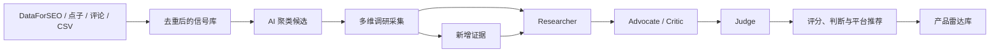
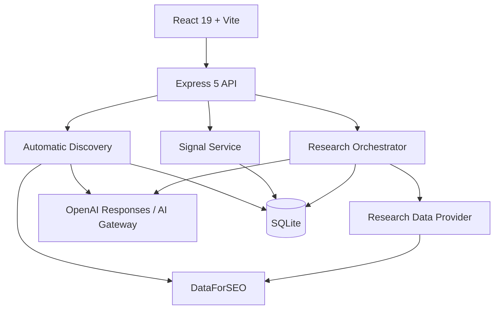

# Product Radar · 产品雷达

[](./LICENSE)
[](https://nodejs.org/)
[](https://react.dev/)
[](https://sqlite.org/)

> An evidence-driven product opportunity database for deciding what Web or iOS product is worth building next.

产品雷达不是普通的点子收藏夹，也不只是输出一份 Top 10 报告。它是一个可以持续更新的产品机会数据库：保存点子、用户抱怨、搜索数据、竞争证据、AI 判断和历史评分，最终回答一个问题：

**我下一步最值得开发什么产品？**

项目面向独立开发者、小型产品团队，以及同时开发 Web 和 iOS 产品的人。

## 目录

- [核心能力](#核心能力)
- [产品如何工作](#产品如何工作)
- [快速开始](#快速开始)
- [Demo 与真实调研](#demo-与真实调研)
- [环境变量](#环境变量)
- [使用方法](#使用方法)
- [CSV 导入格式](#csv-导入格式)
- [评分与判断模型](#评分与判断模型)
- [系统架构](#系统架构)
- [API](#api)
- [生产部署](#生产部署)
- [安全与数据](#安全与数据)
- [当前边界](#当前边界)
- [路线图](#路线图)
- [参与贡献](#参与贡献)

## 核心能力

### 结果导向的首页

- 直接显示当前最值得投入的产品机会；
- 展示最近涨分的候选；
- 汇总已上线、正在开发的产品；
- 原始证据在后台自动归并，不要求人工逐条处理。

### 完整产品雷达库

- 保存全部候选，不限制 Top 10；
- 支持关键词搜索；
- 支持按 Web、iOS、Web+iOS 筛选；
- 支持按判断、评分、涨分、置信度和更新时间排序；
- 支持分页浏览。

### 产品库

- 管理已经上线、正在开发、暂停或归档的产品；
- 同时支持 Web、iOS 和跨平台产品；
- 把现有产品作为 AI 判断“个人匹配度”和资产复用的上下文。

### 原始证据库

系统既能自动采集，也可以手工录入：

- DataForSEO Labs 英文关键词需求与增速；
- Google / Baidu Standard SERP 中的公开痛点页面；
- 中英文市场的 App Store 新上架免费 iOS App；
- 手工产品点子；
- Reddit、X/Twitter、论坛讨论；
- App Store 评论；
- 用户访谈与客服反馈；
- 公开链接；
- CSV 批量数据。

一条用户抱怨不会被直接视为市场结论。自动证据按稳定身份去重，再由 AI 聚类
成候选；手工线索也可以主动加入已有候选。

### 自动发现候选

启用真实模式后，系统每天执行一条低成本发现链路：

1. 从中英文市场采集搜索需求、公开网页痛点和 App Store 新品；
2. 按 App ID、市场和规范化标题自动合并重复证据，并保留全部来源；
3. AI 将互相补强的信号聚类为产品候选，每个候选至少引用两条真实信号；
4. 用稳定的“目标用户 + 核心任务”键去重，新增或更新雷达候选；
5. 候选进入完整多维调研，最终输出是否值得开发。

“自动发现”只负责把有依据的候选送入雷达，不会直接给出 `BUILD_NOW`。最终开发
判断仍由搜索、趋势、痛点、竞争、商业意图、可构建性等证据和四阶段 AI 完成。

### 证据驱动的 AI 判断

真实调研采用三个阶段：

1. **Researcher**：整理事实、数据和证据缺口；
2. **Advocate / Critic**：分别给出支持开发与反对开发的最强论证；
3. **Judge**：基于九个维度输出最终判断、评分、置信度和下一步行动。

### 动态评分与历史版本

- 新证据不会覆盖旧报告；
- 每次调研生成一个新版本；
- 保存旧分数、新分数、变化值和变化原因；
- 新用户信号、候选定义或产品组合变化会把相关判断重新标记为待更新；
- 一个今天不值得做的产品，未来可以因趋势或新数据重新进入优先队列。

## 产品如何工作



一个典型流程：

```text
自动采集搜索、公开痛点与 App Store 数据
→ 去重保存为 Signal
→ AI 合并至少两条信号并创建 Opportunity
→ 收集搜索、趋势、竞争和商业证据
→ AI 正反论证
→ 输出 BUILD_NOW / VALIDATE_FIRST / WATCH / SKIP
→ 未来加入新数据后重新评分
```

## 快速开始

### 环境要求

- Node.js 22 或更高版本；
- npm 10 或更高版本；
- macOS、Linux 或 Windows；
- 真实调研需要能够访问 DeepSeek、OpenAI Responses、Anthropic Messages 或 AI Gateway，以及 DataForSEO。

### 安装

```bash
git clone https://github.com/xiao131/product-radar.git
cd product-radar
npm install
cp .env.example .env
npm run dev
```

打开：

```text
http://127.0.0.1:5173
```

开发模式包含：

- Web 前端：`http://127.0.0.1:5173`
- API：`http://127.0.0.1:8787`
- SQLite：`./data/product-radar.db`

项目第一次启动时会自动创建数据库，并写入一组可重复验证的演示数据。

## Demo 与真实调研

### Demo 模式

默认配置：

```env
RESEARCH_PROVIDER=demo
```

Demo 模式不需要任何 API，可以测试完整流程：

- 添加产品；
- 添加信号；
- 信号转候选；
- 执行调研；
- 查看九维度评分；
- 重新调研；
- 查看评分历史。

所有 Demo 证据都会明确标记为 `DEMO`，不会伪装成真实市场数据。

### 真实模式

真实模式需要：

```env
RESEARCH_PROVIDER=real
RESEARCH_FRESHNESS_DAYS=7
RESEARCH_RATE_LIMIT_PER_HOUR=30

AI_PROVIDER=deepseek
DEEPSEEK_BASE_URL=https://api.deepseek.com
DEEPSEEK_API_KEY=替换为你的密钥
AI_MODEL=deepseek-v4-flash
AI_REASONING_EFFORT=max
AI_DISABLE_RESPONSE_STORAGE=true

DATAFORSEO_LOGIN=...
DATAFORSEO_PASSWORD=...
```

`AI_PROVIDER=deepseek` 使用 DeepSeek 官方 Chat Completions 协议，请求地址为
`https://api.deepseek.com/chat/completions`。项目会明确开启思考模式，并固定发送最高
推理强度 `reasoning_effort=max`。V4 Flash 原生使用 1M 上下文窗口，并按官方限制将
单次最大输出设为 384K。自动发现和四个调研阶段均采用流式响应；结构化结果使用
DeepSeek 支持的 JSON Object 模式。自动发现遇到空输出或无效 JSON 时，会把信号批次
依次缩小为原批次的 1/2、1/4 后重试，已经购买的 DataForSEO 数据不会重复购买。

如需改用 OpenAI，`AI_PROVIDER=openai` 使用 OpenAI Responses 协议。`OPENAI_BASE_URL` 是 API
前缀，程序会在它后面请求 `/responses`；如果中转要求 `/v1/responses`，请把
`OPENAI_BASE_URL` 配成包含 `/v1` 的地址。

Claude 模型应使用 Anthropic Messages 协议：

```env
AI_PROVIDER=anthropic
ANTHROPIC_BASE_URL=https://api.anthropic.com/v1
ANTHROPIC_API_KEY=...
AI_MODEL=claude-opus-5
```

为兼容已有中转配置，Anthropic 模式未设置 `ANTHROPIC_*` 时也会读取
`OPENAI_BASE_URL` 和 `OPENAI_API_KEY`，并自动在 Base URL 后补 `/v1`。

如需继续使用 Vercel AI Gateway：

```env
AI_PROVIDER=gateway
AI_GATEWAY_API_KEY=...
AI_MODEL=openai/gpt-5.6-terra
```

当前真实数据链路包括：

- 自动发现：DataForSEO Labs Keyword Ideas（美国英文市场）；
- 自动发现：Google Standard SERP（英文市场）和 Baidu Standard SERP（中国市场）；
- 自动发现：Apple App Store 新上架免费 iOS App；
- DataForSEO Labs Keyword Overview 英文搜索量、趋势、CPC 和搜索意图；
- Google Ads Standard 中文市场搜索量；
- 过去月份搜索序列变化；
- 广告竞争指数；
- CPC 商业意图；
- Google/Baidu Standard SERP 竞品域名与结果密度；
- Apple App Search 竞品、评分与评论量；
- 手工、CSV、Reddit、App Review 等信号原文；
- 四阶段 AI 结构化判断：研究员、正反辩论、裁判和 MVP 计划。

单市场可以通过 `MARKET_LOCATION_CODE`、`MARKET_LANGUAGE_CODE` 和
`MARKET_COUNTRY_CODE` 配置。需要同时覆盖多个市场时使用
`RESEARCH_MARKETS`；例如英文美国市场和简体中文中国市场：

```env
RESEARCH_MARKETS=US:2840:en:en,CN:2156:zh_CN:zh-CN
```

每一项依次为国家、位置代码、Google Ads 语言代码、SERP/App 语言代码。不同
DataForSEO 产品的简体中文代码不同，因此配置中同时保留两种代码。生产环境请求
`REAL` 模式但凭据不完整时，服务会拒绝启动，避免在你不知情的情况下回退到
Demo。

为控制真实模式成本，普通调研和自动发现都不使用 Google Ads Live。
英文候选优先使用可一次提交数百个关键词的 Labs Keyword Overview；中文市场
使用 Google Ads Standard；竞品搜索使用 Google/Baidu Standard SERP。系统会优先
使用候选所关联信号的市场和需求关键词，只在没有市场证据时才覆盖所有配置市场。

付费数据按数据本身的更新速度缓存：关键词 30 天、竞品 SERP 14 天、App Store
30 天。自动发现中，Labs 每 30 天最多购买一次，痛点 SERP 每 3 天、App Store
新品每天最多一次。调度器仍每天运行，但只购买已过期的数据源。首个中英文
完整发现批次约 `$0.036`；默认稳态发现成本约 `$0.20/月`，以 DataForSEO
实际返回的 cost 为准。

付费采集与 AI 聚类是两个可恢复阶段：数据入库后立即记录 `COLLECTED`；如果 AI
中转超时或失败，当天手工重试只会复用已购买的数据，不会再次调用 DataForSEO。
AI 归并默认每批 60 条、单次任务最多滚动 5 批，并在后续批次保留少量跨批上下文。
因此减小单批大小主要提升中转稳定性，不会把剩余信号永久漏掉。AI 生成最长等待
默认 10 分钟，并与 DataForSEO 网络请求超时完全分离。
调度器无论成功或失败，每天最多自动尝试一次发现任务。自动发现另有默认
`$0.05/天` 专项硬上限，同时受全部 DataForSEO `$0.50/天`、`$10/月` 上限保护。
每次请求发送前先预留预计费用，响应后再以 DataForSEO 报告的实际费用结算。
候选详情中主动点击调研时，如果预计子任务会超过每日数量上限，页面会先展示
新增子任务数、预计费用和执行后的累计费用。用户可以仅对这一次调研确认继续；
`MAX_DATAFORSEO_COST_PER_DAY_USD` 和月度美元上限仍是不可绕过的硬限制，自动任务
也不会使用人工确认额度。

调研结果按决策价值动态刷新：`BUILD_NOW` 7 天、`VALIDATE_FIRST` 14 天、
`WATCH` 30 天、`SKIP` 90 天；出现新用户信号时仍会立即重新判断。详情页的
“检查并更新”会优先命中缓存；“强制刷新”才会忽略该候选的付费数据缓存。
真实模式下，手动调研会立即返回并在后台进入 Standard 批量队列，不会让浏览器请求
等待几个小时。每日 AI 和 DataForSEO 使用量由 SQLite 持久化，
服务重启不会清空。
每日预算和定时小时都以服务器本地时区计算，部署时应明确设置服务器的
`TZ`，例如 `Asia/Shanghai`。

生产环境可以启用内置调度器自动更新，也可以手工执行：

```bash
npm run research:batch
```

这个命令使用 DataForSEO Standard Queue，并通过数据库全局锁避免重复任务。批量采集后，只有首次调研、新增用户证据或市场指标出现明显变化的候选才会重新调用四阶段 AI；其余候选只更新证据时间。

从旧版本升级后，如果历史候选、报告或证据只有一种语言，可以执行一次双语回填：

```bash
npm run localize:content
```

该命令按批次调用当前「设置」中的 AI 模型，补齐中文和英文展示副本，并保留原始
事实、评分、数字与原文。它不会启动市场调研，也不会调用 DataForSEO；重复执行时
只处理仍缺少译文的数据。

## 环境变量

| 变量 | 默认值 | 是否必需 | 用途 |
|---|---:|---:|---|
| `APP_ENV` | `development` | 生产必需 | `development`、`test` 或 `production` |
| `HOST` | `127.0.0.1` | 否 | 服务监听地址 |
| `PORT` | `8787` | 否 | Express API 和生产页面端口 |
| `PUBLIC_ORIGIN` | 本地地址 | 生产必需 | CSRF Origin 校验使用的公开 HTTPS Origin |
| `TRUST_PROXY_HOPS` | `0` | 否 | 反向代理跳数；确认只有一层可信代理时设为 `1` |
| `DATABASE_PATH` | `./data/product-radar.db` | 否 | SQLite 数据库文件 |
| `DATABASE_BUSY_TIMEOUT_MS` | `5000` | 否 | 并发写入等待时间 |
| `SEED_DEMO_DATA` | 开发为 `true` | 否 | 是否显式写入 Demo 数据；生产默认关闭 |
| `AUTH_REQUIRED` | 生产为 `true` | 生产必需 | 生产环境必须启用管理员账号登录 |
| `ADMIN_USERNAME` | `xx131` | 否 | 首次创建管理员账号时使用 |
| `ADMIN_PASSWORD_HASH` | 空 | 首次启动必需 | `npm run auth:hash` 生成的 scrypt 哈希；账号创建后可移除 |
| `SESSION_SECRET` | 空 | 生产鉴权必需 | 至少 32 字符的会话签名密钥 |
| `RESEARCH_PROVIDER` | `demo` | 生产必需 | 生产环境必须显式选择 `demo` 或 `real` |
| `RESEARCH_FRESHNESS_DAYS` | `7` | 否 | 新鲜期内复用调研结果，避免重复付费 |
| `RESEARCH_KEYWORD_CACHE_DAYS` | `30` | 否 | 搜索量、趋势和 CPC 付费证据缓存天数 |
| `RESEARCH_SERP_CACHE_DAYS` | `14` | 否 | Web 竞品 SERP 证据缓存天数 |
| `RESEARCH_APP_CACHE_DAYS` | `30` | 否 | App Store 竞品证据缓存天数 |
| `RESEARCH_RATE_LIMIT_PER_HOUR` | `30` | 否 | 单个客户端每小时最多发起的调研请求 |
| `MAX_AI_RUNS_PER_DAY` | `30` | 否 | 每日最多 AI 调研流水线次数 |
| `MAX_DATAFORSEO_TASKS_PER_DAY` | `100` | 否 | 每日最多 DataForSEO 计费子任务数；一次批量 POST 可包含多个子任务 |
| `MAX_DATAFORSEO_COST_PER_DAY_USD` | `0.5` | 否 | 每日 DataForSEO 美元硬上限，自动发现与调研共享 |
| `MAX_DATAFORSEO_DISCOVERY_COST_PER_DAY_USD` | `0.05` | 否 | 自动发现的独立每日美元硬上限，请求发送前检查 |
| `MAX_DATAFORSEO_COST_PER_MONTH_USD` | `10` | 否 | 每月 DataForSEO 美元硬上限 |
| `MARKET_LOCATION_CODE` | `2840` | 否 | DataForSEO 市场位置代码 |
| `MARKET_LANGUAGE_CODE` | `en` | 否 | 调研语言代码 |
| `MARKET_COUNTRY_CODE` | `US` | 否 | 报告展示和证据记录的国家代码 |
| `RESEARCH_MARKETS` | 使用上面三个单市场变量 | 否 | 多市场列表，格式为 `国家:位置:Ads语言:搜索语言`，逗号分隔 |
| `COLLECT_WEB_COMPETITORS` | `true` | 否 | 是否采集 Google Organic 竞品 |
| `COLLECT_APPLE_MARKET` | `true` | 否 | 是否采集 Apple App Search 数据 |
| `AI_PROVIDER` | 自动选择 | 否 | `deepseek`（官方 Chat Completions）、`openai`（Responses）、`anthropic`（Messages）或 `gateway` |
| `DEEPSEEK_BASE_URL` | `https://api.deepseek.com` | `deepseek` 模式 | DeepSeek 官方 API 前缀，程序请求 `/chat/completions` |
| `DEEPSEEK_API_KEY` | 空 | `deepseek` 真实模式 | 通过 Bearer Header 发送的服务端鉴权密钥 |
| `OPENAI_BASE_URL` | `https://api.openai.com/v1` | `openai` 模式 | OpenAI-compatible API 前缀 |
| `OPENAI_API_KEY` | 空 | `openai` 真实模式 | 通过 Bearer Header 发送的服务端鉴权密钥 |
| `ANTHROPIC_BASE_URL` | `https://api.anthropic.com/v1` | `anthropic` 模式 | Anthropic Messages API 前缀；缺省时兼容读取 `OPENAI_BASE_URL` |
| `ANTHROPIC_API_KEY` | 空 | `anthropic` 真实模式 | Anthropic `x-api-key`；缺省时兼容读取 `OPENAI_API_KEY` |
| `AI_GATEWAY_API_KEY` | 空 | `gateway` 真实模式 | Vercel AI Gateway 鉴权 |
| `AI_MODEL` | 按 Provider 选择 | 否 | `deepseek` 默认 `deepseek-v4-flash`；`openai` 默认 `gpt-5.6-terra`；`anthropic` 默认 `claude-sonnet-4-5`；`gateway` 默认 `openai/gpt-5.6-terra` |
| `AI_REASONING_EFFORT` | DeepSeek 为 `max`，其他为 `xhigh` | 否 | 推理强度；DeepSeek 模式固定为最高 `max` |
| `AI_DISABLE_RESPONSE_STORAGE` | `true` | 否 | 为 `true` 时向 Responses API 发送 `store=false` |
| `AI_REQUEST_TIMEOUT_MS` | `600000` | 否 | 单次 AI 生成最长等待时间；独立于数据供应商请求超时 |
| `RESEARCH_AI_CONCURRENCY` | `1` | 否 | 同时调研的候选数，建议保持 1 以降低 AI 中转计费服务的并发失败 |
| `AUTO_DISCOVERY_ENABLED` | 真实模式为 `true` | 否 | 启用互联网/API 自动发现候选 |
| `DISCOVERY_LABS_LIMIT` | `100` | 否 | 单个支持市场每次 Labs 候选关键词上限 |
| `DISCOVERY_LABS_FRESHNESS_DAYS` | `30` | 否 | Labs 发现数据每市场最短重购间隔 |
| `DISCOVERY_SERP_QUERIES_PER_MARKET` | `8` | 否 | 每市场每个 SERP 发现批次的痛点查询数；设为 `0` 可关闭 |
| `DISCOVERY_SERP_FRESHNESS_DAYS` | `3` | 否 | 痛点 SERP 每市场最短重购间隔 |
| `DISCOVERY_APP_FRESHNESS_DAYS` | `1` | 否 | App Store 新品每市场最短重购间隔 |
| `DISCOVERY_APP_DEPTH` | `100` | 否 | 每市场 App Store 新品扫描深度；设为 `0` 可关闭 |
| `DISCOVERY_MAX_CANDIDATES_PER_RUN` | `5` | 否 | 每个 AI 批次最多新增或更新的候选数 |
| `DISCOVERY_AI_SIGNAL_LIMIT` | `60` | 否 | 每个 AI 归并批次的信号数；后续批次会保留少量上下文 |
| `DISCOVERY_AI_MAX_BATCHES_PER_RUN` | `5` | 否 | 单次自动发现最多滚动执行的 AI 归并批数 |
| `SCHEDULER_ENABLED` | 生产为 `true` | 否 | 启用自动发现、调研和备份 |
| `SCHEDULER_DISCOVERY_HOUR` | `3` | 否 | 服务器本地时区的每日候选发现小时 |
| `SCHEDULER_RESEARCH_HOUR` | `3` | 否 | 服务器本地时区的每日调研小时 |
| `SCHEDULER_BACKUP_HOUR` | `2` | 否 | 服务器本地时区的每日备份小时 |
| `BACKUP_DIRECTORY` | `./data/backups` | 否 | 一致性 SQLite 备份目录 |
| `BACKUP_RETENTION_COUNT` | `14` | 否 | 保留的备份数量 |
| `ALERT_WEBHOOK_URL` | 空 | 否 | 生产任务失败时发送脱敏 JSON 通知 |
| `DATAFORSEO_LOGIN` | 空 | 真实模式必需 | DataForSEO API 登录名 |
| `DATAFORSEO_PASSWORD` | 空 | 真实模式必需 | DataForSEO API 密码 |
| `DATAFORSEO_BATCH_POLL_INTERVAL_MS` | `60000` | 否 | Standard Queue 结果轮询间隔 |
| `DATAFORSEO_BATCH_TIMEOUT_MS` | `14400000` | 否 | Standard Queue 最长等待时间（默认 4 小时） |

不要把 `.env` 提交到 Git。项目已在 `.gitignore` 中排除 `.env` 和本地数据库。

登录后可进入“设置”直接调整 AI 提供商、模型、Base URL、10 分钟生成超时、
归并批次、市场、定时时刻、DataForSEO 美元上限和缓存周期。API Key 采用
`SESSION_SECRET` 派生密钥进行 AES-256-GCM 加密，页面永远不会读回明文。运行中的
任务使用启动时的配置快照，保存内容从下一次任务开始生效。服务器监听、登录、
数据库路径、代理和备份目录等基础设施配置仍由环境变量管理。

“原始证据”页面每 30 秒自动刷新，并展示最近一轮采集的总数、新增数、复用/更新
数、等待 AI 筛选数和最近更新时间。证据总数没有增加并不代表任务未运行；去重命中
时总数保持不变，但更新时间和复用/更新数量会变化。

## 使用方法

### 1. 自动发现候选

真实模式下等待每日任务即可，也可以进入“运行状态”点击“立即发现候选”。如果
当天已经完成付费采集，该按钮只重试 AI 归并，不会重复购买数据。任务
完成后：

- 全部采集数据会出现在原始证据库；
- AI 支持的候选会自动进入雷达库；
- 新候选处于“待调研”，不会被误标为已经值得开发；
- 当相同需求出现新数据时，原候选会更新并重新进入调研队列。

### 2. 添加现有产品

进入“产品库”，添加已经上线或正在开发的产品：

- 名称；
- Web / iOS / Web+iOS；
- 当前状态；
- 产品说明；
- 当前重点；
- 产品网址。

### 3. 添加手工线索

进入“原始证据”，添加点子或用户原话。建议保留完整上下文，不要只写抽象方向。

较好的信号：

```text
每次分享聊天截图前，我都要手动遮住姓名和头像，步骤很多，而且经常漏掉。
```

较弱的信号：

```text
做一个图片工具。
```

### 4. 转成候选

点击“转为候选”。系统会创建一个尚未调研的产品机会，并关联原始信号。

### 5. 执行调研

在候选详情页点击“开始调研”。完成后可以看到：

- 最终判断；
- 综合分；
- 置信度；
- Web 与 iOS 平台匹配；
- 九维度评分；
- 支持和反对理由；
- 风险与未知项；
- 最小 MVP；
- 真实验证门槛；
- 本次使用的证据。

### 6. 重新评分

点击“重新采集并评分”。系统会追加新证据和新报告版本，不会删除旧结论。

## CSV 导入格式

「原始证据」和「我的产品」都支持 CSV。导入窗口会先完成格式校验、重复检测和前
20 行预览；存在错误时不会写入任何数据，并可下载错误报告。两个页面都可以直接
下载带 UTF-8 BOM 的空白模板，兼容 Excel 和 WPS 的中文显示。

### 原始证据

```csv
title,content,source_type,source_url,tags,market,original_language,source_name,collected_at,external_id
分享截图前隐藏隐私,"每次都要手动遮住姓名、头像",APP_REVIEW,https://example.com/review,privacy;screenshot,CN/zh-CN,zh-CN,App Store,2026-08-03,review-123
```

字段：

| 字段 | 必需 | 说明 |
|---|---:|---|
| `title` | 是 | 信号标题 |
| `content` | 是 | 原始内容 |
| `source_type` | 否 | 信号来源 |
| `source_url` | 否 | 原始链接 |
| `tags` | 否 | 使用分号分隔 |
| `market` | 否 | 例如 `CN/zh-CN`、`US/en` |
| `original_language` | 否 | `zh-CN`、`en`、`mixed`、`und`；留空自动识别 |
| `source_name` | 否 | 具体来源名称 |
| `collected_at` | 否 | 原始采集日期，支持 `YYYY-MM-DD` 或 ISO 8601；留空使用导入时间 |
| `external_id` | 否 | 外部系统中的稳定 ID，用于重复导入去重 |

可用的 `source_type`：

```text
IDEA
REDDIT
X
APP_REVIEW
APP_STORE
SEARCH
TREND
FORUM
CUSTOMER
OTHER
```

如果没有 `external_id`，系统会用来源类型、链接、标题和原文生成稳定指纹。重复行和
库中已有证据会在预检中标记，并在导入时跳过。

### 我的产品

```csv
name,platform,status,url,description,current_focus
Photo GPS,IOS,LIVE,https://example.com/photo-gps,查看与清除照片定位信息,优化商店截图与英文关键词
```

`name`、`platform` 必填；`platform` 支持 `WEB`、`IOS`、`WEB_AND_IOS`。
`status` 留空时默认为 `LIVE`，也可以使用 `IDEA`、`BUILDING`、`LIVE`、
`PAUSED`、`ARCHIVED`。产品优先按 URL 去重；URL 为空时按名称和平台去重，已有
产品不会被 CSV 覆盖。

## 评分与判断模型

系统使用九个评分维度：

| 维度 | 权重 | 关注问题 |
|---|---:|---|
| 需求强度 | 16% | 是否存在持续、可观察的需求 |
| 痛点强度 | 15% | 问题是否具体、重复且迫切 |
| 趋势动量 | 11% | 需求正在增长、稳定还是下降 |
| 付费意愿 | 13% | 是否有价格、CPC 或付费行为证据 |
| 竞争空档 | 12% | 现有产品是否没有解决关键工作流 |
| 用户触达 | 9% | 是否能低成本找到目标用户 |
| 可构建性 | 10% | 独立开发者能否快速完成 MVP |
| 个人匹配 | 9% | 是否能复用已有技术与产品资产 |
| 证据新鲜度 | 5% | 数据是否足够新 |

最终判断：

| 判断 | 含义 |
|---|---|
| `BUILD_NOW` | 证据、时机和实现范围都支持立即进入 MVP |
| `VALIDATE_FIRST` | 方向可能成立，但必须先验证付费或关键假设 |
| `WATCH` | 保留观察，等待趋势或新证据 |
| `SKIP` | 暂停投入，把时间用于更高分机会 |

高分不一定意味着 `BUILD_NOW`。如果存在致命风险、证据不足或无法触达用户，Judge 可以否决高分候选。

## 系统架构



技术栈：

```text
Frontend   React 19 / Vite 8 / 轻量 History API 路由
Backend    Express 5 / TypeScript
Database   SQLite / better-sqlite3
AI         Vercel AI SDK / OpenAI Responses / AI Gateway
Validation Zod
Testing    Vitest / Supertest
```

主要数据表：

```text
products
signals
opportunities
evidence_items
research_reports
discovery_runs
settings
```

## API

### 系统

| Method | Endpoint | 说明 |
|---|---|---|
| `GET` | `/api/health/live` | 进程存活检查 |
| `GET` | `/api/health/ready` | 数据库和迁移就绪检查 |
| `GET` | `/api/auth/session` | 当前安全会话 |
| `POST` | `/api/auth/login` | 管理员账号密码登录 |
| `POST` | `/api/auth/logout` | 退出会话 |
| `GET` | `/api/auth/account` | 当前管理员账号 |
| `PATCH` | `/api/auth/account` | 修改账号或密码 |
| `GET` | `/api/settings` | 当前运行模式与连接状态 |
| `GET` | `/api/dashboard` | 首页数据 |
| `GET` | `/api/operations/status` | 预算、任务、备份与新鲜度 |
| `POST` | `/api/operations/discovery` | 手工启动一次自动候选发现 |
| `POST` | `/api/operations/research` | 手工更新到期数据 |
| `POST` | `/api/operations/backup` | 创建并验证备份 |

### 候选产品

| Method | Endpoint | 说明 |
|---|---|---|
| `GET` | `/api/opportunities` | 分页、筛选和排序 |
| `GET` | `/api/opportunities/options` | 信号关联候选时的精简列表 |
| `GET` | `/api/opportunities/:id` | 完整调研档案 |
| `PATCH` | `/api/opportunities/:id` | 更新候选 |
| `POST` | `/api/opportunities/:id/research` | 执行调研或重新评分 |

列表查询参数：

```text
page
pageSize
sortBy
sortDirection
query
platform
verdict
researchStatus
```

### 产品

| Method | Endpoint | 说明 |
|---|---|---|
| `GET` | `/api/products` | 产品列表 |
| `POST` | `/api/products` | 添加产品 |
| `GET` | `/api/products/import/template` | 下载产品 CSV 模板 |
| `POST` | `/api/products/import/preview` | 预检产品 CSV |
| `POST` | `/api/products/import` | 导入产品 CSV |
| `PATCH` | `/api/products/:id` | 更新产品 |

### 信号

| Method | Endpoint | 说明 |
|---|---|---|
| `GET` | `/api/signals` | 信号列表 |
| `POST` | `/api/signals` | 添加信号 |
| `GET` | `/api/signals/import/template` | 下载证据 CSV 模板 |
| `POST` | `/api/signals/import/preview` | 预检证据 CSV |
| `POST` | `/api/signals/import` | 导入 CSV |
| `POST` | `/api/signals/:id/process` | 信号转候选 |
| `POST` | `/api/signals/:id/link` | 把信号作为证据关联到已有候选 |

## 开发命令

```bash
# 启动前端与 API
npm run dev

# 只启动 API
npm run dev:api

# 只启动前端
npm run dev:web

# 类型检查
npm run typecheck

# 自动化测试
npm test

# 生产构建
npm run build

# 启动生产服务
npm start

# 初始化演示数据
npm run seed
```

## 生产部署

### 构建并运行

当前仓库使用 `tsx` 直接运行服务端 TypeScript；`npm run build` 负责类型检查和
前端静态资源构建。编译后的纯 Node 服务端产物和 Docker 镜像尚未纳入当前源码
边界，后续会作为独立部署任务补充。

```bash
git clone https://github.com/xiao131/product-radar.git
cd product-radar
npm ci
cp .env.example .env

# 编辑 .env 后：
npm test
npm run build
npm start
```

生产模式由 Express 同时提供前端静态文件和 JSON API：

```text
http://127.0.0.1:8787
```

### 推荐服务器结构

```text
Internet
   ↓
HTTPS / Nginx / Access Control
   ↓
Product Radar :8787
   ↓
SQLite persistent volume
   ↓
OpenAI Responses 或 AI Gateway + DataForSEO
```

### 推荐数据库路径

```env
DATABASE_PATH=/var/lib/product-radar/product-radar.db
BACKUP_DIRECTORY=/var/lib/product-radar/backups
```

确保运行服务的用户拥有该目录的读写权限。应用使用 SQLite Backup API
生成一致性快照、执行 `integrity_check` 并按保留数量自动清理。

### 生产登录

首次部署时生成密码哈希：

```bash
RADAR_ADMIN_PASSWORD='使用密码管理器生成的长密码' npm run auth:hash
```

把输出和随机会话密钥写入服务器 `.env`：

```env
APP_ENV=production
PUBLIC_ORIGIN=https://radar.example.com
AUTH_REQUIRED=true
ADMIN_USERNAME=xx131
ADMIN_PASSWORD_HASH=scrypt$...
SESSION_SECRET=至少32字符的高强度随机值
SEED_DEMO_DATA=false
RESEARCH_PROVIDER=real
TRUST_PROXY_HOPS=1
```

生产模式缺少这些值、关闭鉴权、未显式选择调研模式，或真实模式缺少 AI /
DataForSEO 凭据时都会拒绝启动。首次启动后管理员账号会写入
SQLite，之后可在「设置 → 账号管理」修改账号和密码，并移除
`ADMIN_PASSWORD_HASH` 环境变量。

忘记密码时，可在服务器上直接重置：

```bash
RADAR_ADMIN_PASSWORD='新的长密码' npm run auth:reset
```

需要同时修改账号时，再传入
`RADAR_ADMIN_USERNAME='new-admin'`。重置后旧登录会话立即失效。

### Nginx 示例

```nginx
server {
    listen 443 ssl http2;
    server_name radar.example.com;

    location / {
        proxy_pass http://127.0.0.1:8787;
        proxy_http_version 1.1;
        proxy_set_header Host $host;
        proxy_set_header X-Real-IP $remote_addr;
        proxy_set_header X-Forwarded-For $proxy_add_x_forwarded_for;
        proxy_set_header X-Forwarded-Proto $scheme;
    }
}
```

内置单用户登录已经保护雷达数据和写操作；Cloudflare Access、VPN 或 Nginx
Basic Auth 仍可作为额外边界。

### systemd 示例

```ini
[Unit]
Description=Product Radar
After=network.target

[Service]
Type=simple
User=product-radar
WorkingDirectory=/opt/product-radar
EnvironmentFile=/opt/product-radar/.env
ExecStart=/usr/bin/npm start
Restart=always
RestartSec=5

[Install]
WantedBy=multi-user.target
```

### 备份恢复

“系统状态”页面可以立即创建备份。恢复命令只会创建一个新数据库文件，不会
覆盖现有数据库：

```bash
npm run backup:restore -- \
  /var/lib/product-radar/backups/product-radar-2026-07-30.db \
  /var/lib/product-radar/restored.db
```

确认恢复文件后，把 `DATABASE_PATH` 指向它并重启服务。

## 安全与数据

- API 密钥只在服务端读取；
- 生产环境使用签名 HttpOnly 会话、SameSite Cookie、Origin 与 CSRF 双重校验；
- 登录、普通请求和付费调研分别限流；
- 每日 AI 与 DataForSEO 预算保存在 SQLite，不会因重启清空；
- 运行状态分别展示 DataForSEO 计费提交、计费子任务和美元费用；
- `.env` 不会提交到 Git；
- SQLite 数据库默认不会提交；
- 导入的社交数据不需要保存用户身份信息；
- 页面不会直接渲染未经处理的 HTML；
- 外部证据在 Prompt 中明确作为不可信数据处理；
- AI 关键结论保存证据引用、模型版本、Prompt 版本和 token 用量；
- 建议同时在 AI Provider 后台设置月度硬预算。

## 当前边界

当前版本已经完整实现产品管理、信号管理、雷达库、调研判断、证据展示与版本化评分，但仍有这些限制：

- 中国大陆没有 DataForSEO Labs Google 关键词库，因此中文发现使用 Baidu
  Standard SERP；英文市场额外使用 Labs Keyword Ideas；
- 自动发现用 Labs 自带的搜索变化字段标记趋势，尚未单独调用 Google Trends
  endpoint；
- Apple 数据当前以关键词竞品、评分与评论量为主，尚未自动抓取每个竞品的完整评论主题；
- Reddit 与 X 没有使用官方专用连接器；当前会从 Google/Baidu 公开结果中识别
  Reddit、X 和论坛页面，也支持手工或 CSV 导入原文；
- 当前是可修改账号密码的单管理员登录，不是多租户 SaaS；
- SQLite 适合个人或小团队单实例使用，不适合多个写入节点。
- 当前生产启动仍依赖 `tsx`；纯 Node 编译产物与 Docker 部署尚未实现。

这些边界不会影响 Demo 流程或手工导入数据，但会影响自动化和真实市场覆盖范围。

## 路线图

- [x] 可配置国家、语言与市场；
- [x] 中英文市场自动发现、AI 聚类与候选去重；
- [ ] 独立 DataForSEO Trends endpoint；
- [ ] Apple App Store 竞品完整差评主题；
- [ ] 合规的 Reddit / X 数据连接器；
- [x] 每日调度、按数据源新鲜度自动采集与重新评分；
- [x] 持久化任务锁、重试与状态记录；
- [x] 单用户登录、CSRF 与 API 限流；
- [ ] 编译后的纯 Node 运行环境与 Docker 部署；
- [ ] PostgreSQL 可选后端；
- [ ] 数据导出；
- [ ] 自定义评分权重；
- [ ] Webhook 与通知。

欢迎通过 [Issues](https://github.com/xiao131/product-radar/issues) 提交需求、数据源建议和 Bug。

## 项目结构

```text
product-radar/
├── server/                     # Express API、数据库与调研服务
│   ├── app.ts                  # API 路由
│   ├── db.ts                   # SQLite schema 与启动
│   ├── providers.ts            # Demo / DataForSEO Provider
│   ├── discovery-provider.ts   # 低成本自动发现数据源
│   ├── discovery.ts            # AI 聚类与候选去重入库
│   └── research.ts             # 四阶段 AI 调研
├── shared/                     # 前后端共享类型与 Zod Schema
├── src/
│   ├── pages/                  # 首页、雷达库、产品库、信号与详情
│   ├── components.tsx
│   └── styles.css
├── specs/product-radar-mvp/    # 需求、设计与实施任务
├── DEVELOPMENT.md              # 开发文档
└── product_radar_development_spec.md
```

## 参与贡献

1. Fork 本仓库；
2. 创建功能分支；
3. 保持改动聚焦；
4. 添加或更新测试；
5. 运行：

```bash
npm test
npm run typecheck
npm run build
```

6. 提交 Pull Request，说明改动原因、用户影响和验证方式。

如果你准备新增数据源，请同时说明：

- 数据来源；
- 使用条款与授权方式；
- 地区和语言；
- 更新频率；
- 费用；
- 数据如何参与最终判断。

## 相关文档

- [产品设计文档](./product_radar_development_spec.md)
- [开发与架构文档](./DEVELOPMENT.md)
- [MVP 需求](./specs/product-radar-mvp/requirements.md)
- [技术设计](./specs/product-radar-mvp/design.md)
- [实施任务](./specs/product-radar-mvp/tasks.md)

## License

[MIT](./LICENSE) © 2026 xiao131
