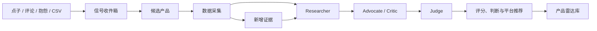
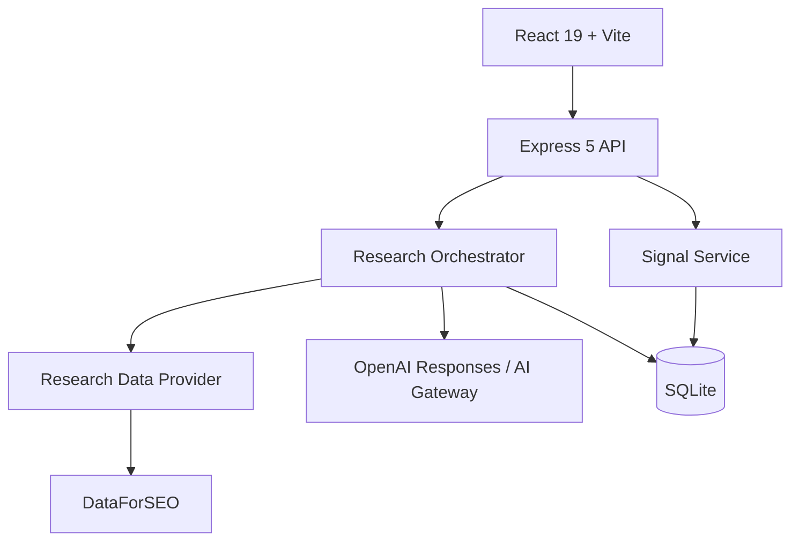

# Product Radar · 产品雷达

[](./LICENSE)
[](https://nodejs.org/)
[](https://react.dev/)
[](https://sqlite.org/)

> An evidence-driven product opportunity database for deciding what Web or iOS product is worth building next.

产品雷达不是普通的点子收藏夹，也不只是输出一份 Top 10 报告。它是一个可以持续更新的产品机会数据库：保存点子、用户抱怨、搜索数据、竞争证据、AI 判断和历史评分，最终回答一个问题：

**我下一步最值得开发什么产品？**

项目面向独立开发者、小型产品团队，以及同时开发 Web 和 iOS 产品的人。

## 目录

- [核心能力](#核心能力)
- [产品如何工作](#产品如何工作)
- [快速开始](#快速开始)
- [Demo 与真实调研](#demo-与真实调研)
- [环境变量](#环境变量)
- [使用方法](#使用方法)
- [CSV 导入格式](#csv-导入格式)
- [评分与判断模型](#评分与判断模型)
- [系统架构](#系统架构)
- [API](#api)
- [生产部署](#生产部署)
- [安全与数据](#安全与数据)
- [当前边界](#当前边界)
- [路线图](#路线图)
- [参与贡献](#参与贡献)

## 核心能力

### 结果导向的首页

- 直接显示当前最值得投入的产品机会；
- 展示最近涨分的候选；
- 汇总已上线、正在开发的产品；
- 显示等待处理的原始信号。

### 完整产品雷达库

- 保存全部候选，不限制 Top 10；
- 支持关键词搜索；
- 支持按 Web、iOS、Web+iOS 筛选；
- 支持按判断、评分、涨分、置信度和更新时间排序；
- 支持分页浏览。

### 产品库

- 管理已经上线、正在开发、暂停或归档的产品；
- 同时支持 Web、iOS 和跨平台产品；
- 把现有产品作为 AI 判断“个人匹配度”和资产复用的上下文。

### 信号收件箱

可以录入：

- 手工产品点子；
- Reddit、X/Twitter、论坛讨论；
- App Store 评论；
- 用户访谈与客服反馈；
- 公开链接；
- CSV 批量数据。

一条用户抱怨不会被直接视为市场结论。信号需要先转成候选，再进入调研与判断。

### 证据驱动的 AI 判断

真实调研采用三个阶段：

1. **Researcher**：整理事实、数据和证据缺口；
2. **Advocate / Critic**：分别给出支持开发与反对开发的最强论证；
3. **Judge**：基于九个维度输出最终判断、评分、置信度和下一步行动。

### 动态评分与历史版本

- 新证据不会覆盖旧报告；
- 每次调研生成一个新版本；
- 保存旧分数、新分数、变化值和变化原因；
- 一个今天不值得做的产品，未来可以因趋势或新数据重新进入优先队列。

## 产品如何工作



一个典型流程：

```text
发现一条用户抱怨
→ 保存为 Signal
→ 转成 Opportunity
→ 收集搜索、趋势、竞争和商业证据
→ AI 正反论证
→ 输出 BUILD_NOW / VALIDATE_FIRST / WATCH / SKIP
→ 未来加入新数据后重新评分
```

## 快速开始

### 环境要求

- Node.js 22 或更高版本；
- npm 10 或更高版本；
- macOS、Linux 或 Windows；
- 真实调研需要能够访问 OpenAI-compatible Responses API 或 AI Gateway，以及 DataForSEO。

### 安装

```bash
git clone https://github.com/xiao131/product-radar.git
cd product-radar
npm install
cp .env.example .env
npm run dev
```

打开：

```text
http://127.0.0.1:5173
```

开发模式包含：

- Web 前端：`http://127.0.0.1:5173`
- API：`http://127.0.0.1:8787`
- SQLite：`./data/product-radar.db`

项目第一次启动时会自动创建数据库，并写入一组可重复验证的演示数据。

## Demo 与真实调研

### Demo 模式

默认配置：

```env
RESEARCH_PROVIDER=demo
```

Demo 模式不需要任何 API，可以测试完整流程：

- 添加产品；
- 添加信号；
- 信号转候选；
- 执行调研；
- 查看九维度评分；
- 重新调研；
- 查看评分历史。

所有 Demo 证据都会明确标记为 `DEMO`，不会伪装成真实市场数据。

### 真实模式

真实模式需要：

```env
RESEARCH_PROVIDER=real
RESEARCH_FRESHNESS_DAYS=7
RESEARCH_RATE_LIMIT_PER_HOUR=30

AI_PROVIDER=openai
OPENAI_BASE_URL=https://mdkj.lol
OPENAI_API_KEY=替换为重新生成的密钥
AI_MODEL=gpt-5.6-terra
AI_REASONING_EFFORT=xhigh
AI_DISABLE_RESPONSE_STORAGE=true

DATAFORSEO_LOGIN=...
DATAFORSEO_PASSWORD=...
```

`AI_PROVIDER=openai` 使用 OpenAI Responses 协议。`OPENAI_BASE_URL` 是 API
前缀，程序会在它后面请求 `/responses`；如果中转要求 `/v1/responses`，请把
`OPENAI_BASE_URL` 配成包含 `/v1` 的地址。

如需继续使用 Vercel AI Gateway：

```env
AI_PROVIDER=gateway
AI_GATEWAY_API_KEY=...
AI_MODEL=openai/gpt-5.6-terra
```

当前真实数据链路包括：

- Google Ads 月搜索量；
- 过去月份搜索序列变化；
- 广告竞争指数；
- CPC 商业意图；
- 三阶段 AI 结构化判断。

只有所选 AI Provider 和 DataForSEO 凭据全部存在时，系统才会进入 `REAL` 模式。否则自动回退到 `DEMO`。

为控制真实模式成本，系统默认复用 7 天内的调研结果。详情页的“检查并更新”会优先命中缓存；只有确认“强制实时刷新”时才会忽略新鲜度保护。雷达库的“更新到期数据”会把最多 1000 个到期关键词合并为一个 Live 任务。

需要定时低成本更新时，可以由 cron、launchd 或部署平台的定时任务执行：

```bash
npm run research:batch
```

这个命令使用 DataForSEO Standard Queue，将所有到期关键词合并为一个任务，并等待结果就绪。任务通常比 Live 便宜，但可能需要较长时间，因此不在交互式页面请求中执行。批量采集后，只有首次调研或市场指标出现明显变化的候选才会重新调用三阶段 AI；其余候选只更新证据时间。

## 环境变量

| 变量 | 默认值 | 是否必需 | 用途 |
|---|---:|---:|---|
| `PORT` | `8787` | 否 | Express API 和生产页面端口 |
| `DATABASE_PATH` | `./data/product-radar.db` | 否 | SQLite 数据库文件 |
| `RESEARCH_PROVIDER` | `demo` | 真实模式必需 | `demo` 或 `real` |
| `RESEARCH_FRESHNESS_DAYS` | `7` | 否 | 新鲜期内复用调研结果，避免重复付费 |
| `RESEARCH_RATE_LIMIT_PER_HOUR` | `30` | 否 | 单个客户端每小时最多发起的调研请求 |
| `AI_PROVIDER` | 自动选择 | 否 | `openai`（Responses 中转/官方 API）或 `gateway` |
| `OPENAI_BASE_URL` | `https://api.openai.com/v1` | `openai` 模式 | OpenAI-compatible API 前缀 |
| `OPENAI_API_KEY` | 空 | `openai` 真实模式 | 通过 Bearer Header 发送的服务端鉴权密钥 |
| `AI_GATEWAY_API_KEY` | 空 | `gateway` 真实模式 | Vercel AI Gateway 鉴权 |
| `AI_MODEL` | 按 Provider 选择 | 否 | `openai` 默认 `gpt-5.6-terra`；`gateway` 默认 `openai/gpt-5.6-terra` |
| `AI_REASONING_EFFORT` | `xhigh` | 否 | Responses 推理强度：`none`/`low`/`medium`/`high`/`xhigh`/`max` |
| `AI_DISABLE_RESPONSE_STORAGE` | `true` | 否 | 为 `true` 时向 Responses API 发送 `store=false` |
| `DATAFORSEO_LOGIN` | 空 | 真实模式必需 | DataForSEO API 登录名 |
| `DATAFORSEO_PASSWORD` | 空 | 真实模式必需 | DataForSEO API 密码 |
| `DATAFORSEO_BATCH_POLL_INTERVAL_MS` | `60000` | 否 | Standard Queue 结果轮询间隔 |
| `DATAFORSEO_BATCH_TIMEOUT_MS` | `14400000` | 否 | Standard Queue 最长等待时间（默认 4 小时） |

不要把 `.env` 提交到 Git。项目已在 `.gitignore` 中排除 `.env` 和本地数据库。

## 使用方法

### 1. 添加现有产品

进入“产品库”，添加已经上线或正在开发的产品：

- 名称；
- Web / iOS / Web+iOS；
- 当前状态；
- 产品说明；
- 当前重点；
- 产品网址。

### 2. 添加原始信号

进入“信号收件箱”，添加点子或用户原话。建议保留完整上下文，不要只写抽象方向。

较好的信号：

```text
每次分享聊天截图前，我都要手动遮住姓名和头像，步骤很多，而且经常漏掉。
```

较弱的信号：

```text
做一个图片工具。
```

### 3. 转成候选

点击“转为候选”。系统会创建一个尚未调研的产品机会，并关联原始信号。

### 4. 执行调研

在候选详情页点击“开始调研”。完成后可以看到：

- 最终判断；
- 综合分；
- 置信度；
- Web 与 iOS 平台匹配；
- 九维度评分；
- 支持和反对理由；
- 风险与未知项；
- 最小 MVP；
- 真实验证门槛；
- 本次使用的证据。

### 5. 重新评分

点击“重新采集并评分”。系统会追加新证据和新报告版本，不会删除旧结论。

## CSV 导入格式

信号收件箱支持 CSV 文件。

```csv
title,content,source_type,source_url,tags
分享截图前隐藏隐私,每次都要手动遮住姓名和头像,APP_REVIEW,https://example.com/review,privacy;screenshot
日历没有可用时间视图,我想看到真正可用的两小时空档,REDDIT,https://example.com/post,calendar;productivity
```

字段：

| 字段 | 必需 | 说明 |
|---|---:|---|
| `title` | 是 | 信号标题 |
| `content` | 是 | 原始内容 |
| `source_type` | 否 | 信号来源 |
| `source_url` | 否 | 原始链接 |
| `tags` | 否 | 使用分号分隔 |

可用的 `source_type`：

```text
IDEA
REDDIT
X
APP_REVIEW
FORUM
CUSTOMER
OTHER
```

## 评分与判断模型

系统使用九个评分维度：

| 维度 | 权重 | 关注问题 |
|---|---:|---|
| 需求强度 | 16% | 是否存在持续、可观察的需求 |
| 痛点强度 | 15% | 问题是否具体、重复且迫切 |
| 趋势动量 | 11% | 需求正在增长、稳定还是下降 |
| 付费意愿 | 13% | 是否有价格、CPC 或付费行为证据 |
| 竞争空档 | 12% | 现有产品是否没有解决关键工作流 |
| 用户触达 | 9% | 是否能低成本找到目标用户 |
| 可构建性 | 10% | 独立开发者能否快速完成 MVP |
| 个人匹配 | 9% | 是否能复用已有技术与产品资产 |
| 证据新鲜度 | 5% | 数据是否足够新 |

最终判断：

| 判断 | 含义 |
|---|---|
| `BUILD_NOW` | 证据、时机和实现范围都支持立即进入 MVP |
| `VALIDATE_FIRST` | 方向可能成立，但必须先验证付费或关键假设 |
| `WATCH` | 保留观察，等待趋势或新证据 |
| `SKIP` | 暂停投入，把时间用于更高分机会 |

高分不一定意味着 `BUILD_NOW`。如果存在致命风险、证据不足或无法触达用户，Judge 可以否决高分候选。

## 系统架构



技术栈：

```text
Frontend   React 19 / Vite 8 / 轻量 History API 路由
Backend    Express 5 / TypeScript
Database   SQLite / better-sqlite3
AI         Vercel AI SDK / OpenAI Responses / AI Gateway
Validation Zod
Testing    Vitest / Supertest
```

主要数据表：

```text
products
signals
opportunities
evidence_items
research_reports
discovery_runs
settings
```

## API

### 系统

| Method | Endpoint | 说明 |
|---|---|---|
| `GET` | `/api/health` | 健康检查 |
| `GET` | `/api/settings` | 当前运行模式与连接状态 |
| `GET` | `/api/dashboard` | 首页数据 |

### 候选产品

| Method | Endpoint | 说明 |
|---|---|---|
| `GET` | `/api/opportunities` | 分页、筛选和排序 |
| `GET` | `/api/opportunities/:id` | 完整调研档案 |
| `PATCH` | `/api/opportunities/:id` | 更新候选 |
| `POST` | `/api/opportunities/:id/research` | 执行调研或重新评分 |

列表查询参数：

```text
page
pageSize
sortBy
sortDirection
query
platform
verdict
researchStatus
```

### 产品

| Method | Endpoint | 说明 |
|---|---|---|
| `GET` | `/api/products` | 产品列表 |
| `POST` | `/api/products` | 添加产品 |
| `PATCH` | `/api/products/:id` | 更新产品 |

### 信号

| Method | Endpoint | 说明 |
|---|---|---|
| `GET` | `/api/signals` | 信号列表 |
| `POST` | `/api/signals` | 添加信号 |
| `POST` | `/api/signals/import` | 导入 CSV |
| `POST` | `/api/signals/:id/process` | 信号转候选 |

## 开发命令

```bash
# 启动前端与 API
npm run dev

# 只启动 API
npm run dev:api

# 只启动前端
npm run dev:web

# 类型检查
npm run typecheck

# 自动化测试
npm test

# 生产构建
npm run build

# 启动生产服务
npm start

# 初始化演示数据
npm run seed
```

## 生产部署

### 构建并运行

```bash
git clone https://github.com/xiao131/product-radar.git
cd product-radar
npm ci
cp .env.example .env

# 编辑 .env 后：
npm test
npm run build
npm start
```

生产模式由 Express 同时提供前端静态文件和 JSON API：

```text
http://127.0.0.1:8787
```

### 推荐服务器结构

```text
Internet
   ↓
HTTPS / Nginx / Access Control
   ↓
Product Radar :8787
   ↓
SQLite persistent volume
   ↓
OpenAI Responses 或 AI Gateway + DataForSEO
```

### 推荐数据库路径

```env
DATABASE_PATH=/var/lib/product-radar/product-radar.db
```

确保运行服务的用户拥有该目录的读写权限，并配置定时备份。

### Nginx 示例

```nginx
server {
    listen 443 ssl http2;
    server_name radar.example.com;

    # 建议使用 Basic Auth、VPN 或 Cloudflare Access。
    auth_basic "Product Radar";
    auth_basic_user_file /etc/nginx/.htpasswd-product-radar;

    location / {
        proxy_pass http://127.0.0.1:8787;
        proxy_http_version 1.1;
        proxy_set_header Host $host;
        proxy_set_header X-Real-IP $remote_addr;
        proxy_set_header X-Forwarded-For $proxy_add_x_forwarded_for;
        proxy_set_header X-Forwarded-Proto $scheme;
    }
}
```

### systemd 示例

```ini
[Unit]
Description=Product Radar
After=network.target

[Service]
Type=simple
User=product-radar
WorkingDirectory=/opt/product-radar
EnvironmentFile=/opt/product-radar/.env
ExecStart=/usr/bin/npm start
Restart=always
RestartSec=5

[Install]
WantedBy=multi-user.target
```

本项目暂时没有内置多用户登录。部署到公网时，请务必使用反向代理、VPN 或访问控制服务保护网站和调研接口。

## 安全与数据

- API 密钥只在服务端读取；
- `.env` 不会提交到 Git；
- SQLite 数据库默认不会提交；
- 导入的社交数据不需要保存用户身份信息；
- 页面不会直接渲染未经处理的 HTML；
- 公开部署时必须保护 `/api/opportunities/:id/research`，否则他人可能消耗你的 AI 与数据 API 余额；
- 建议为 AI Provider API Key 设置月度预算；
- 建议每日备份 SQLite。

## 当前边界

当前版本已经完整实现产品管理、信号管理、雷达库、调研判断、证据展示与版本化评分，但仍有这些限制：

- DataForSEO 当前只接入 Google Ads 搜索量接口；
- 搜索位置和语言当前固定为美国与英语；
- DataForSEO Trends 尚未单独接入；
- Apple App Data 尚未接入；
- Reddit 与 X 自动采集尚未实现；
- 暂无自动每日更新任务；
- 暂无多用户账号系统；
- SQLite 适合个人或小团队单实例使用，不适合多个写入节点。

这些边界不会影响 Demo 流程或手工导入数据，但会影响自动化和真实市场覆盖范围。

## 路线图

- [ ] 可配置国家、语言与市场；
- [ ] DataForSEO Trends；
- [ ] Apple App Store 搜索、竞品、评分与评论；
- [ ] 合规的 Reddit / X 数据连接器；
- [ ] 每日自动采集与重新评分；
- [ ] 调研任务队列与重试；
- [ ] 单用户登录与 API 限流；
- [ ] PostgreSQL 可选后端；
- [ ] 数据导出；
- [ ] 自定义评分权重；
- [ ] Webhook 与通知。

欢迎通过 [Issues](https://github.com/xiao131/product-radar/issues) 提交需求、数据源建议和 Bug。

## 项目结构

```text
product-radar/
├── server/                     # Express API、数据库与调研服务
│   ├── app.ts                  # API 路由
│   ├── db.ts                   # SQLite schema 与启动
│   ├── providers.ts            # Demo / DataForSEO Provider
│   └── research.ts             # 三阶段 AI 调研
├── shared/                     # 前后端共享类型与 Zod Schema
├── src/
│   ├── pages/                  # 首页、雷达库、产品库、信号与详情
│   ├── components.tsx
│   └── styles.css
├── specs/product-radar-mvp/    # 需求、设计与实施任务
├── DEVELOPMENT.md              # 开发文档
└── product_radar_development_spec.md
```

## 参与贡献

1. Fork 本仓库；
2. 创建功能分支；
3. 保持改动聚焦；
4. 添加或更新测试；
5. 运行：

```bash
npm test
npm run typecheck
npm run build
```

6. 提交 Pull Request，说明改动原因、用户影响和验证方式。

如果你准备新增数据源，请同时说明：

- 数据来源；
- 使用条款与授权方式；
- 地区和语言；
- 更新频率；
- 费用；
- 数据如何参与最终判断。

## 相关文档

- [产品设计文档](./product_radar_development_spec.md)
- [开发与架构文档](./DEVELOPMENT.md)
- [MVP 需求](./specs/product-radar-mvp/requirements.md)
- [技术设计](./specs/product-radar-mvp/design.md)
- [实施任务](./specs/product-radar-mvp/tasks.md)

## License

[MIT](./LICENSE) © 2026 xiao131
