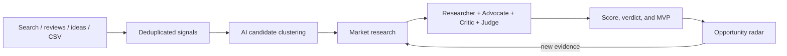

# Product Radar

**English** | [简体中文](./README.zh-CN.md)

[](./LICENSE)
[](https://nodejs.org/)
[](https://react.dev/)
[](https://sqlite.org/)

> An evidence-driven database for deciding which Web or iOS product is worth building next.

Product Radar turns ideas, user complaints, search demand, competitor data, and AI analysis into a continuously updated opportunity pipeline. It is designed for independent developers and small product teams.

## Highlights

- **Opportunity radar** — search, filter, sort, and track every candidate instead of keeping a one-off Top 10.
- **Evidence library** — collect ideas, reviews, interviews, public pages, search data, App Store data, and CSV imports.
- **Automatic discovery** — deduplicate signals, cluster related needs with AI, and create evidence-backed candidates.
- **Four-role research** — Researcher, Advocate, Critic, and Judge produce scores, risks, evidence citations, and an MVP plan.
- **Versioned decisions** — retain historical reports, score changes, and the evidence behind each update.
- **Product lifecycle** — manage confirmed products, verification status, archive/trash/restore flows, and reclassify mistaken products as raw evidence.
- **Cost controls** — cache paid data and enforce daily/monthly AI and DataForSEO limits.
- **Bilingual UI and content** — support English and Simplified Chinese markets and display copies.

## How it works



Automatic discovery never assigns `BUILD_NOW` directly. A candidate must first pass evidence collection and the full decision pipeline.

## Quick start

Requirements: Node.js 22+, npm 10+, and macOS, Linux, or Windows.

```bash
git clone https://github.com/xiao131/product-radar.git
cd product-radar
npm install
cp .env.example .env
npm run dev
```

Open `http://127.0.0.1:5173`. Development mode runs:

- Web UI: `http://127.0.0.1:5173`
- API: `http://127.0.0.1:8787`
- SQLite: `./data/product-radar.db`

The first launch creates the database and loads repeatable demo data.

## Demo and live research

Demo mode is the default and requires no external APIs:

```env
RESEARCH_PROVIDER=demo
```

For live research, configure an AI provider and DataForSEO:

```env
RESEARCH_PROVIDER=real

AI_PROVIDER=deepseek
DEEPSEEK_BASE_URL=https://api.deepseek.com
DEEPSEEK_API_KEY=replace-with-your-key
AI_MODEL=deepseek-v4-flash

DATAFORSEO_LOGIN=...
DATAFORSEO_PASSWORD=...
```

Supported AI paths:

| Provider | Protocol | Main variables |
|---|---|---|
| DeepSeek | Chat Completions | `DEEPSEEK_BASE_URL`, `DEEPSEEK_API_KEY` |
| OpenAI | Responses | `OPENAI_BASE_URL`, `OPENAI_API_KEY` |
| Anthropic | Messages | `ANTHROPIC_BASE_URL`, `ANTHROPIC_API_KEY` |
| Vercel AI Gateway | Gateway | `AI_GATEWAY_API_KEY` |

Live mode can collect DataForSEO keyword/SERP data, Apple App Store competitors, public pain-point pages, and manually imported evidence. Paid results are cached, usage is persisted in SQLite, and hard cost limits are checked before requests.

Configure multiple markets with:

```env
RESEARCH_MARKETS=US:2840:en:en,CN:2156:zh_CN:zh-CN
```

See [.env.example](./.env.example) for the complete configuration reference. Runtime AI, market, schedule, cache, and budget settings can also be changed from the Settings page.

## Typical workflow

1. Add existing, confirmed products to the product portfolio.
2. Collect signals automatically or add ideas and user feedback manually.
3. Convert a signal into a candidate, or let AI cluster related signals.
4. Run research from the candidate detail page.
5. Review the verdict, nine-dimensional score, evidence, risks, and MVP plan.
6. Add new evidence and re-run research without losing older report versions.

Products are reserved for work that was genuinely built or is being built. Undeveloped ideas belong in Raw Evidence. If an item was classified incorrectly, reclassify it into a signal instead of deleting its history.

## Decisions and scoring

The weighted score covers demand, pain, trend, willingness to pay, competitive gap, reachability, buildability, founder fit, and evidence freshness.

| Verdict | Meaning |
|---|---|
| `BUILD_NOW` | Evidence and scope support starting an MVP now |
| `VALIDATE_FIRST` | Validate payment intent or another critical assumption first |
| `WATCH` | Wait for stronger trends or new evidence |
| `SKIP` | Spend time on a better opportunity |

A high score does not guarantee `BUILD_NOW`; fatal risks, weak evidence, or poor reachability can override it.

## CSV imports

Raw Evidence and Products both provide downloadable UTF-8 CSV templates, validation, duplicate detection, a 20-row preview, and downloadable error reports.

- Signal sources include `IDEA`, `REDDIT`, `X`, `APP_REVIEW`, `APP_STORE`, `SEARCH`, `TREND`, `FORUM`, `CUSTOMER`, and `OTHER`.
- Product platforms include `UNKNOWN`, `WEB`, `IOS`, and `WEB_AND_IOS`.
- Product verification accepts `CONFIRMED` or `NEEDS_REVIEW`.
- Existing records are never overwritten silently.

## Technology

```text
Frontend   React 19 / Vite 8 / TypeScript
Backend    Express 5 / Zod
Database   SQLite / better-sqlite3
AI         Vercel AI SDK
Testing    Vitest / Supertest
```

```text
src/       React UI
server/    API, database, discovery, research, jobs, and backups
shared/    Shared types and schemas
specs/     Requirements, designs, and implementation plans
```

## Commands

```bash
npm run dev              # UI + API
npm run dev:api          # API only
npm run dev:web          # UI only
npm run typecheck        # TypeScript checks
npm test                 # Automated tests
npm run build            # Production frontend build
npm start                # Production server
npm run research:batch   # Manual research batch
npm run localize:content # Backfill bilingual content
```

## Production

```bash
npm ci
npm test
npm run build
npm start
```

Express serves both the built UI and API on port `8787`. Put it behind HTTPS, use a persistent SQLite path, and configure backups:

```env
APP_ENV=production
PUBLIC_ORIGIN=https://radar.example.com
AUTH_REQUIRED=true
DATABASE_PATH=/var/lib/product-radar/product-radar.db
BACKUP_DIRECTORY=/var/lib/product-radar/backups
SESSION_SECRET=a-strong-random-value-with-at-least-32-characters
SEED_DEMO_DATA=false
RESEARCH_PROVIDER=real
```

Generate the initial administrator password hash with a password of at least 8 characters:

```bash
RADAR_ADMIN_PASSWORD='strong-password' npm run auth:hash
```

Reset a lost password with `npm run auth:reset`. Account changes invalidate older sessions.

## Security and current limits

- Credentials stay on the server; saved AI keys use AES-256-GCM encryption.
- Production uses signed HttpOnly sessions, SameSite cookies, origin checks, CSRF protection, and rate limits.
- AI and DataForSEO usage survives restarts and is protected by configurable hard budgets.
- SQLite targets personal or small-team single-instance deployments, not multiple writer nodes.
- Reddit and X currently rely on public search results or manual/CSV imports rather than dedicated official connectors.
- Apple research does not yet collect complete review themes for every competitor.
- Production currently runs server TypeScript with `tsx`; Docker and compiled plain-Node artifacts are not included yet.

## Documentation

- [Development and architecture](./DEVELOPMENT.md)
- [Product design](./product_radar_development_spec.md)
- [MVP requirements](./specs/product-radar-mvp/requirements.md)
- [MVP technical design](./specs/product-radar-mvp/design.md)
- [MVP implementation tasks](./specs/product-radar-mvp/tasks.md)

Contributions and bug reports are welcome through [GitHub Issues](https://github.com/xiao131/product-radar/issues). Before opening a pull request, run `npm test`, `npm run typecheck`, and `npm run build`.

## License

[MIT](./LICENSE) © 2026 xiao131
