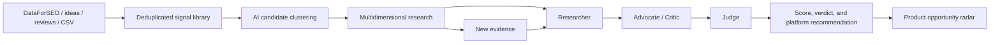
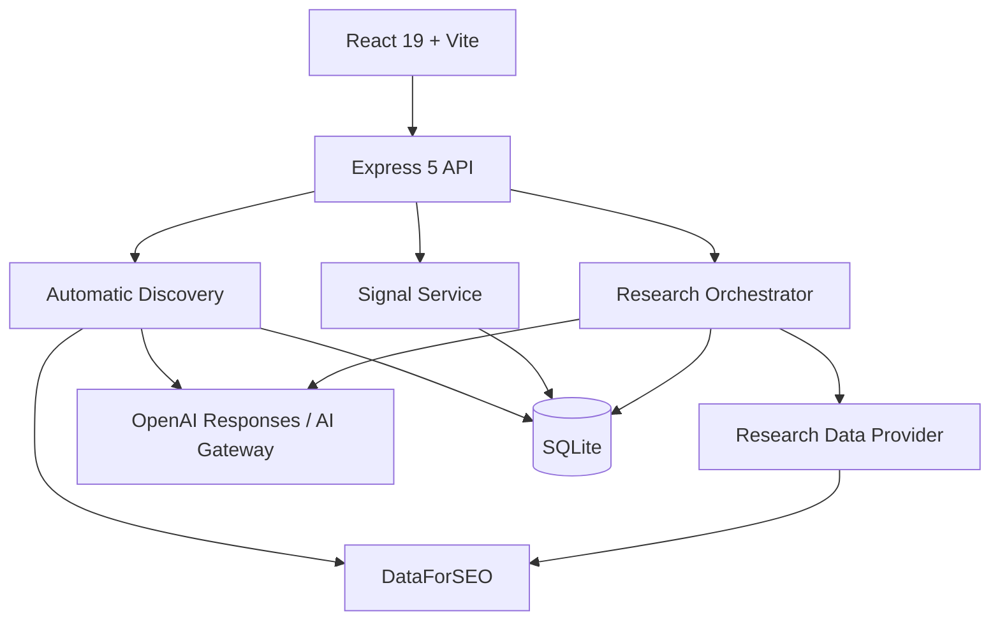

# Product Radar

**English** | [简体中文](./README.zh-CN.md)

[](./LICENSE)
[](https://nodejs.org/)
[](https://react.dev/)
[](https://sqlite.org/)

> An evidence-driven product opportunity database for deciding which Web or iOS product is worth building next.

Product Radar is more than an idea backlog or a one-off Top 10 report. It is a continuously updated product opportunity database that stores ideas, user complaints, search data, competitive evidence, AI judgments, and historical scores to answer one question:

**What is the most worthwhile product for me to build next?**

It is designed for independent developers, small product teams, and builders working across both Web and iOS.

## Table of contents

- [Core capabilities](#core-capabilities)
- [How it works](#how-it-works)
- [Quick start](#quick-start)
- [Demo and live research](#demo-and-live-research)
- [Environment variables](#environment-variables)
- [Usage](#usage)
- [CSV import formats](#csv-import-formats)
- [Scoring and decision model](#scoring-and-decision-model)
- [Architecture](#architecture)
- [API](#api)
- [Production deployment](#production-deployment)
- [Security and data](#security-and-data)
- [Current limitations](#current-limitations)
- [Roadmap](#roadmap)
- [Contributing](#contributing)

## Core capabilities

### Outcome-focused dashboard

- Shows the opportunities most worth pursuing now.
- Highlights recently improving candidates.
- Summarizes live products and products in development.
- Consolidates raw evidence in the background instead of requiring manual review of every item.

### Complete opportunity radar

- Stores every candidate instead of limiting the database to a Top 10.
- Supports keyword search.
- Filters by Web, iOS, or Web+iOS.
- Sorts by verdict, score, score change, confidence, or update time.
- Supports paginated browsing.

### Product portfolio

- Manages products that are live, in development, paused, or archived.
- Supports Web, iOS, and cross-platform products.
- Uses the existing portfolio as context for founder-fit scoring and asset reuse.

### Raw evidence library

The system can collect evidence automatically or accept manual input from:

- DataForSEO Labs keyword demand and growth for English-language markets.
- Public pain-point pages from Google and Baidu Standard SERP.
- Newly released free iOS apps in English and Chinese App Store markets.
- Manually entered product ideas.
- Reddit, X/Twitter, and forum discussions.
- App Store reviews.
- User interviews and support feedback.
- Public URLs.
- Bulk CSV imports.

A single complaint is never treated as a market conclusion. Automatically collected evidence is deduplicated using stable identities before AI clusters it into candidates. Manual signals can also be linked to an existing candidate.

### Automatic candidate discovery

When live mode is enabled, the system runs a low-cost discovery pipeline every day:

1. Collect search demand, public pain points, and new App Store releases across English and Chinese markets.
2. Merge duplicate evidence by App ID, market, and normalized title while preserving every source.
3. Ask AI to cluster mutually reinforcing signals into product candidates, with at least two real signals cited by each candidate.
4. Deduplicate candidates with a stable target-user + core-job key, then create or update radar entries.
5. Send candidates through full multidimensional research before deciding whether they are worth building.

Automatic discovery only places evidence-backed candidates into the radar. It never assigns `BUILD_NOW` directly. The final decision still depends on search, trend, pain, competition, commercial intent, buildability, and the four-part AI review.

### Evidence-driven AI decisions

Live research uses four roles:

1. **Researcher** organizes facts, data, and evidence gaps.
2. **Advocate** presents the strongest case for building the product.
3. **Critic** presents the strongest case against it.
4. **Judge** produces the final verdict, score, confidence, and next action across nine dimensions.

### Dynamic scoring and version history

- New evidence never overwrites an old report.
- Every research run creates a new version.
- Old scores, new scores, deltas, and reasons for the change are retained.
- New user signals, candidate definition changes, and portfolio changes mark affected decisions for refresh.
- An opportunity that is not worth building today can return to the priority list when trends or evidence change.

## How it works



A typical flow:

```text
Collect search, public pain-point, and App Store data automatically
→ Deduplicate and store it as Signals
→ Let AI combine at least two signals into an Opportunity
→ Collect search, trend, competition, and commercial evidence
→ Run the AI arguments for and against the opportunity
→ Produce BUILD_NOW / VALIDATE_FIRST / WATCH / SKIP
→ Re-score when new data arrives
```

## Quick start

### Requirements

- Node.js 22 or later.
- npm 10 or later.
- macOS, Linux, or Windows.
- Live research requires access to DeepSeek, OpenAI Responses, Anthropic Messages, or AI Gateway, plus DataForSEO.

### Install

```bash
git clone https://github.com/xiao131/product-radar.git
cd product-radar
npm install
cp .env.example .env
npm run dev
```

Open:

```text
http://127.0.0.1:5173
```

Development mode includes:

- Web UI: `http://127.0.0.1:5173`
- API: `http://127.0.0.1:8787`
- SQLite database: `./data/product-radar.db`

The first launch creates the database automatically and inserts a repeatable demo dataset.

## Demo and live research

### Demo mode

Default configuration:

```env
RESEARCH_PROVIDER=demo
```

Demo mode requires no external API and supports the complete workflow:

- Add products.
- Add signals.
- Convert signals into candidates.
- Run research.
- Review nine-dimensional scores.
- Re-run research.
- Inspect score history.

Every demo evidence item is explicitly labeled `DEMO`; demo content is never presented as real market data.

### Live mode

Live mode requires:

```env
RESEARCH_PROVIDER=real
RESEARCH_FRESHNESS_DAYS=7
RESEARCH_RATE_LIMIT_PER_HOUR=30

AI_PROVIDER=deepseek
DEEPSEEK_BASE_URL=https://api.deepseek.com
DEEPSEEK_API_KEY=replace-with-your-key
AI_MODEL=deepseek-v4-flash
AI_REASONING_EFFORT=max
AI_DISABLE_RESPONSE_STORAGE=true

DATAFORSEO_LOGIN=...
DATAFORSEO_PASSWORD=...
```

With `AI_PROVIDER=deepseek`, the project uses DeepSeek's Chat Completions protocol at `https://api.deepseek.com/chat/completions`. Reasoning is explicitly enabled with the maximum `reasoning_effort=max`. V4 Flash uses its native 1M context window, with the per-request output cap set to 384K according to provider limits. Automatic discovery and all four research roles use streaming responses, while structured results use DeepSeek's JSON Object mode. If discovery receives an empty response or invalid JSON, it retries with batches reduced to 1/2 and then 1/4 of the original size without buying the same DataForSEO data again.

To use OpenAI instead, set `AI_PROVIDER=openai`. This uses the OpenAI Responses protocol. `OPENAI_BASE_URL` is treated as the API prefix and `/responses` is appended. If your relay expects `/v1/responses`, include `/v1` in `OPENAI_BASE_URL`.

Claude models use the Anthropic Messages protocol:

```env
AI_PROVIDER=anthropic
ANTHROPIC_BASE_URL=https://api.anthropic.com/v1
ANTHROPIC_API_KEY=...
AI_MODEL=claude-opus-5
```

For compatibility with existing relays, Anthropic mode falls back to `OPENAI_BASE_URL` and `OPENAI_API_KEY` when `ANTHROPIC_*` variables are absent, and appends `/v1` to the Base URL when necessary.

To continue using Vercel AI Gateway:

```env
AI_PROVIDER=gateway
AI_GATEWAY_API_KEY=...
AI_MODEL=openai/gpt-5.6-terra
```

The live-data pipeline currently includes:

- Automatic discovery through DataForSEO Labs Keyword Ideas for the US English market.
- Automatic discovery through Google Standard SERP for English markets and Baidu Standard SERP for China.
- Automatic discovery of newly released free iOS apps in the Apple App Store.
- English search volume, trend, CPC, and intent from DataForSEO Labs Keyword Overview.
- Chinese-market search volume from Google Ads Standard.
- Historical monthly search changes.
- Advertising competition indices.
- CPC-based commercial intent.
- Competitor domains and result density from Google/Baidu Standard SERP.
- Competitor apps, ratings, and review counts from Apple App Search.
- Original manual, CSV, Reddit, App Review, and other signal text.
- Structured AI decisions from the Researcher, Advocate, Critic, Judge, and MVP planning steps.

Configure a single market with `MARKET_LOCATION_CODE`, `MARKET_LANGUAGE_CODE`, and `MARKET_COUNTRY_CODE`. Use `RESEARCH_MARKETS` for multiple markets. For example, to cover both the US English market and mainland China in Simplified Chinese:

```env
RESEARCH_MARKETS=US:2840:en:en,CN:2156:zh_CN:zh-CN
```

Each entry contains country, location code, Google Ads language code, and SERP/App language code. DataForSEO products use different Simplified Chinese identifiers, so the configuration retains both codes. In production, requesting `REAL` mode with incomplete credentials stops startup instead of silently falling back to demo data.

To control cost, neither regular research nor automatic discovery uses Google Ads Live. English candidates prefer Labs Keyword Overview, which accepts hundreds of keywords in a single submission. The Chinese market uses Google Ads Standard, while competitive search uses Google/Baidu Standard SERP. The system prioritizes the markets and demand keywords attached to a candidate's signals and only queries every configured market when no market evidence exists.

Paid data is cached according to its update rate: keywords for 30 days, competitor SERP for 14 days, and App Store results for 30 days. During discovery, Labs is purchased at most once per market every 30 days, pain-point SERP every 3 days, and new App Store releases once per day. The scheduler still runs daily but only purchases expired sources. The first complete English + Chinese discovery batch costs about `$0.036`; the default steady-state discovery cost is roughly `$0.20/month`, subject to the actual cost reported by DataForSEO.

Paid collection and AI clustering are recoverable stages. Data is recorded as `COLLECTED` immediately after insertion. If the AI relay times out or fails, a manual retry on the same day reuses the purchased data without calling DataForSEO again. AI clustering processes 60 signals per batch by default, rolls through up to 5 batches per run, and retains a small amount of cross-batch context. Reducing the batch size therefore improves relay stability without permanently omitting the remaining signals. The default maximum AI generation time is 10 minutes and is independent of the DataForSEO network timeout.

Whether discovery succeeds or fails, the scheduler automatically attempts it at most once per day. Automatic discovery has a dedicated `$0.05/day` hard limit and is also protected by the overall DataForSEO limits of `$0.50/day` and `$10/month`. Estimated cost is reserved before each request, then settled using the actual cost reported by DataForSEO. When research is started manually from a candidate detail page and the estimated subtasks would exceed the daily task-count limit, the UI first shows the new subtask count, estimated cost, and resulting cumulative cost. A user can approve that one research run, but the daily and monthly dollar limits remain non-bypassable hard limits. Automated tasks never use manual approval allowances.

Research freshness depends on decision value: `BUILD_NOW` 7 days, `VALIDATE_FIRST` 14 days, `WATCH` 30 days, and `SKIP` 90 days. A new user signal still triggers immediate reassessment. **Check and update** on the detail page prefers cached data; only **Force refresh** ignores paid-data cache for that candidate. In live mode, manual research returns immediately and joins the Standard batch queue in the background instead of holding a browser request open for hours. Daily AI and DataForSEO usage is persisted in SQLite and survives service restarts.

Daily budgets and scheduler hours use the server's local time zone. Set `TZ` explicitly in production, for example `Asia/Shanghai`.

Production can use the built-in scheduler or run research manually:

```bash
npm run research:batch
```

This command uses the DataForSEO Standard Queue and a database-wide lock to prevent duplicate runs. After batch collection, the four-role AI review only runs for first-time research, new user evidence, or meaningful changes in market metrics. Other candidates only receive refreshed evidence timestamps.

After upgrading from an older version, backfill English and Chinese display copies for historical candidates, reports, or evidence with:

```bash
npm run localize:content
```

This command uses the AI model configured in **Settings** to fill missing English and Chinese display content in batches while preserving original facts, scores, numbers, and source text. It does not start market research or call DataForSEO, and repeated runs only process records that still lack a translation.

## Environment variables

| Variable | Default | Required | Purpose |
|---|---:|---:|---|
| `APP_ENV` | `development` | Production | `development`, `test`, or `production` |
| `HOST` | `127.0.0.1` | No | Service bind address |
| `PORT` | `8787` | No | Express API and production UI port |
| `PUBLIC_ORIGIN` | Local origin | Production | Public HTTPS origin used for CSRF origin checks |
| `TRUST_PROXY_HOPS` | `0` | No | Trusted reverse-proxy hop count; set to `1` only with exactly one trusted proxy |
| `DATABASE_PATH` | `./data/product-radar.db` | No | SQLite database file |
| `DATABASE_BUSY_TIMEOUT_MS` | `5000` | No | Concurrent-write wait time |
| `SEED_DEMO_DATA` | `true` in development | No | Explicitly seed demo data; disabled by default in production |
| `AUTH_REQUIRED` | `true` in production | Production | Production must require administrator sign-in |
| `ADMIN_USERNAME` | `xx131` | No | Username used when the administrator account is first created |
| `ADMIN_PASSWORD_HASH` | Empty | First startup | scrypt hash created with `npm run auth:hash`; removable after the account is stored |
| `SESSION_SECRET` | Empty | Production auth | Session-signing secret of at least 32 characters |
| `RESEARCH_PROVIDER` | `demo` | Production | Production must explicitly select `demo` or `real` |
| `RESEARCH_FRESHNESS_DAYS` | `7` | No | Reuse recent research results to avoid duplicate paid calls |
| `RESEARCH_KEYWORD_CACHE_DAYS` | `30` | No | Paid search volume, trend, and CPC evidence cache |
| `RESEARCH_SERP_CACHE_DAYS` | `14` | No | Web competitor SERP evidence cache |
| `RESEARCH_APP_CACHE_DAYS` | `30` | No | App Store competitor evidence cache |
| `RESEARCH_RATE_LIMIT_PER_HOUR` | `30` | No | Maximum research requests per client per hour |
| `MAX_AI_RUNS_PER_DAY` | `30` | No | Maximum AI research pipelines per day |
| `MAX_DATAFORSEO_TASKS_PER_DAY` | `100` | No | Maximum billed DataForSEO subtasks per day; one batch POST can contain several subtasks |
| `MAX_DATAFORSEO_COST_PER_DAY_USD` | `0.5` | No | Shared daily DataForSEO hard limit for discovery and research |
| `MAX_DATAFORSEO_DISCOVERY_COST_PER_DAY_USD` | `0.05` | No | Separate daily discovery hard limit checked before sending requests |
| `MAX_DATAFORSEO_COST_PER_MONTH_USD` | `10` | No | Monthly DataForSEO hard limit |
| `MARKET_LOCATION_CODE` | `2840` | No | DataForSEO market location code |
| `MARKET_LANGUAGE_CODE` | `en` | No | Research language code |
| `MARKET_COUNTRY_CODE` | `US` | No | Country code shown in reports and evidence |
| `RESEARCH_MARKETS` | Single-market variables above | No | Comma-separated `country:location:ads-language:search-language` entries |
| `COLLECT_WEB_COMPETITORS` | `true` | No | Collect Google Organic competitors |
| `COLLECT_APPLE_MARKET` | `true` | No | Collect Apple App Search data |
| `AI_PROVIDER` | Auto-selected | No | `deepseek` (official Chat Completions), `openai` (Responses), `anthropic` (Messages), or `gateway` |
| `DEEPSEEK_BASE_URL` | `https://api.deepseek.com` | DeepSeek mode | Official DeepSeek API prefix; the app requests `/chat/completions` |
| `DEEPSEEK_API_KEY` | Empty | DeepSeek live mode | Server-side credential sent in a Bearer header |
| `OPENAI_BASE_URL` | `https://api.openai.com/v1` | OpenAI mode | OpenAI-compatible API prefix |
| `OPENAI_API_KEY` | Empty | OpenAI live mode | Server-side credential sent in a Bearer header |
| `ANTHROPIC_BASE_URL` | `https://api.anthropic.com/v1` | Anthropic mode | Anthropic Messages API prefix; falls back to `OPENAI_BASE_URL` |
| `ANTHROPIC_API_KEY` | Empty | Anthropic live mode | Anthropic `x-api-key`; falls back to `OPENAI_API_KEY` |
| `AI_GATEWAY_API_KEY` | Empty | Gateway live mode | Vercel AI Gateway credential |
| `AI_MODEL` | Provider-specific | No | Defaults: DeepSeek `deepseek-v4-flash`, OpenAI `gpt-5.6-terra`, Anthropic `claude-sonnet-4-5`, Gateway `openai/gpt-5.6-terra` |
| `AI_REASONING_EFFORT` | `max` for DeepSeek, `xhigh` otherwise | No | Reasoning level; DeepSeek mode always uses the maximum `max` |
| `AI_DISABLE_RESPONSE_STORAGE` | `true` | No | Sends `store=false` to the Responses API when enabled |
| `AI_REQUEST_TIMEOUT_MS` | `600000` | No | Maximum AI generation time, independent of provider-data timeouts |
| `RESEARCH_AI_CONCURRENCY` | `1` | No | Candidates researched concurrently; keep at 1 to reduce relay billing failures |
| `AUTO_DISCOVERY_ENABLED` | `true` in live mode | No | Enable automatic candidate discovery through internet APIs |
| `DISCOVERY_LABS_LIMIT` | `100` | No | Maximum Labs candidate keywords per supported market and run |
| `DISCOVERY_LABS_FRESHNESS_DAYS` | `30` | No | Minimum repurchase interval for Labs discovery per market |
| `DISCOVERY_SERP_QUERIES_PER_MARKET` | `8` | No | Pain-point queries per market and SERP discovery batch; set to `0` to disable |
| `DISCOVERY_SERP_FRESHNESS_DAYS` | `3` | No | Minimum repurchase interval for pain-point SERP per market |
| `DISCOVERY_APP_FRESHNESS_DAYS` | `1` | No | Minimum repurchase interval for App Store releases per market |
| `DISCOVERY_APP_DEPTH` | `100` | No | New App Store releases scanned per market; set to `0` to disable |
| `DISCOVERY_MAX_CANDIDATES_PER_RUN` | `5` | No | Maximum candidates created or updated by each AI batch |
| `DISCOVERY_AI_SIGNAL_LIMIT` | `60` | No | Signals per AI clustering batch; later batches retain some context |
| `DISCOVERY_AI_MAX_BATCHES_PER_RUN` | `5` | No | Maximum rolling AI clustering batches per discovery run |
| `SCHEDULER_ENABLED` | `true` in production | No | Enable automatic discovery, research, and backup jobs |
| `SCHEDULER_DISCOVERY_HOUR` | `3` | No | Daily discovery hour in the server's local time zone |
| `SCHEDULER_RESEARCH_HOUR` | `3` | No | Daily research hour in the server's local time zone |
| `SCHEDULER_BACKUP_HOUR` | `2` | No | Daily backup hour in the server's local time zone |
| `BACKUP_DIRECTORY` | `./data/backups` | No | Directory for consistent SQLite backups |
| `BACKUP_RETENTION_COUNT` | `14` | No | Number of backups retained |
| `ALERT_WEBHOOK_URL` | Empty | No | Send redacted JSON notifications when production jobs fail |
| `DATAFORSEO_LOGIN` | Empty | Live mode | DataForSEO API login |
| `DATAFORSEO_PASSWORD` | Empty | Live mode | DataForSEO API password |
| `DATAFORSEO_BATCH_POLL_INTERVAL_MS` | `60000` | No | Standard Queue result polling interval |
| `DATAFORSEO_BATCH_TIMEOUT_MS` | `14400000` | No | Maximum Standard Queue wait, 4 hours by default |

Do not commit `.env`. The repository's `.gitignore` excludes `.env` files and local databases.

After signing in, use **Settings** to change the AI provider, model, Base URL, 10-minute generation timeout, clustering batch sizes, markets, schedule, DataForSEO dollar limits, and cache periods. API keys are encrypted with AES-256-GCM using a key derived from `SESSION_SECRET`, and plaintext keys are never returned to the page. Running jobs use the configuration snapshot from their start time; saved changes apply to the next job. Infrastructure settings such as binding, authentication, database paths, proxy hops, and backup directories remain environment-variable controlled.

The **Raw Evidence** page refreshes every 30 seconds and shows totals from the latest collection run: collected, added, reused/updated, waiting for AI review, and last updated. An unchanged total does not mean the task failed to run: deduplication can keep the total stable while updating timestamps and reuse counts.

## Usage

### 1. Discover candidates automatically

In live mode, wait for the daily job or open **Operations** and choose **Discover candidates now**. If paid collection already completed that day, the action retries only AI clustering and does not repurchase the same data. After completion:

- All collected data appears in the raw evidence library.
- AI-supported candidates enter the radar automatically.
- New candidates start as **Unresearched**, never as falsely confirmed build opportunities.
- New data for the same need updates the existing candidate and returns it to the research queue.

### 2. Add existing products

Open **Products** and add products that are live or under development:

- Name.
- Web / iOS / Web+iOS.
- Current status.
- Description.
- Current focus.
- Product URL.

### 3. Add a manual signal

Open **Raw Evidence** and add an idea or a user's own words. Keep the full context rather than reducing it to an abstract category.

A strong signal:

```text
Before sharing a chat screenshot, I have to hide names and avatars manually. It takes several steps, and I often miss something.
```

A weak signal:

```text
Build an image tool.
```

### 4. Convert a signal into a candidate

Choose **Convert to candidate**. The system creates an unresearched product opportunity and links the original signal.

### 5. Run research

Choose **Start research** on a candidate detail page. The completed report includes:

- Final verdict.
- Overall score.
- Confidence.
- Web and iOS fit.
- Nine-dimensional scoring.
- Supporting and opposing arguments.
- Risks and unknowns.
- Minimum MVP.
- Real-world validation threshold.
- Evidence used in the decision.

### 6. Re-score

Choose **Collect and score again**. The system appends new evidence and a new report version without deleting older conclusions.

## CSV import formats

Both **Raw Evidence** and **Products** support CSV import. The import dialog validates format, detects duplicates, and previews the first 20 rows before writing anything. Any error prevents the entire import and can be downloaded as a report. Both pages provide sample templates with a UTF-8 BOM for correct display in Excel and WPS. Replace or remove the valid example row before importing production data.

### Raw evidence

```csv
title,content,source_type,source_url,tags,market,original_language,source_name,collected_at,external_id
Hide private data before sharing screenshots,"I have to cover names and avatars manually every time",APP_REVIEW,https://example.com/review,privacy;screenshot,US/en,en,App Store,2026-08-03,review-123
```

Fields:

| Field | Required | Description |
|---|---:|---|
| `title` | Yes | Signal title |
| `content` | Yes | Original content |
| `source_type` | No | Signal source |
| `source_url` | No | Original URL |
| `tags` | No | Semicolon-separated tags |
| `market` | No | For example `CN/zh-CN` or `US/en` |
| `original_language` | No | `zh-CN`, `en`, `mixed`, or `und`; blank means auto-detect |
| `source_name` | No | Specific source name |
| `collected_at` | No | Original collection date in `YYYY-MM-DD` or ISO 8601; blank uses import time |
| `external_id` | No | Stable source-system ID used for repeat-import deduplication |

Supported `source_type` values:

```text
IDEA
REDDIT
X
APP_REVIEW
APP_STORE
SEARCH
TREND
FORUM
CUSTOMER
OTHER
```

If `external_id` is absent, the system creates a stable fingerprint from source type, URL, title, and original text. Duplicate rows and existing evidence are marked during preview and skipped during import.

### Products

```csv
name,platform,status,url,description,current_focus,verification_status
Photo GPS,IOS,LIVE,https://example.com/photo-gps,View and remove photo location metadata,Improve App Store screenshots and English keywords,CONFIRMED
```

`name` and `platform` are required. `platform` accepts `UNKNOWN`, `WEB`, `IOS`, or `WEB_AND_IOS`. A blank `status` defaults to `LIVE`; supported values are `BUILDING`, `LIVE`, `PAUSED`, and `ARCHIVED`. `verification_status` accepts `CONFIRMED` or `NEEDS_REVIEW`. Undeveloped ideas do not belong in products and should be imported as raw evidence. Products are deduplicated by URL first, then by name and platform when no URL is supplied. CSV imports never overwrite an existing product.

## Scoring and decision model

The system scores nine dimensions:

| Dimension | Weight | Key question |
|---|---:|---|
| Demand | 16% | Is there sustained and observable demand? |
| Pain | 15% | Is the problem specific, repeated, and urgent? |
| Trend momentum | 11% | Is demand growing, stable, or declining? |
| Willingness to pay | 13% | Is there evidence from pricing, CPC, or buying behavior? |
| Competitive gap | 12% | Do existing products miss a critical workflow? |
| Reachability | 9% | Can target users be reached at low cost? |
| Buildability | 10% | Can an independent developer ship the MVP quickly? |
| Founder fit | 9% | Can existing technical and product assets be reused? |
| Evidence freshness | 5% | Is the data recent enough? |

Final verdicts:

| Verdict | Meaning |
|---|---|
| `BUILD_NOW` | Evidence, timing, and scope support moving directly into an MVP |
| `VALIDATE_FIRST` | The direction may work, but willingness to pay or another critical assumption must be validated first |
| `WATCH` | Keep watching for stronger trends or new evidence |
| `SKIP` | Stop investing and use the time on a higher-scoring opportunity |

A high score does not guarantee `BUILD_NOW`. The Judge can reject a high-scoring candidate when it has a fatal risk, insufficient evidence, or no viable way to reach users.

## Architecture



Technology stack:

```text
Frontend   React 19 / Vite 8 / lightweight History API routing
Backend    Express 5 / TypeScript
Database   SQLite / better-sqlite3
AI         Vercel AI SDK / OpenAI Responses / AI Gateway
Validation Zod
Testing    Vitest / Supertest
```

Main tables:

```text
products
signals
opportunities
evidence_items
research_reports
discovery_runs
settings
```

## API

### System

| Method | Endpoint | Description |
|---|---|---|
| `GET` | `/api/health/live` | Process liveness check |
| `GET` | `/api/health/ready` | Database and migration readiness check |
| `GET` | `/api/auth/session` | Current secure session |
| `POST` | `/api/auth/login` | Administrator username/password sign-in |
| `POST` | `/api/auth/logout` | Sign out |
| `GET` | `/api/auth/account` | Current administrator account |
| `PATCH` | `/api/auth/account` | Update the username or password |
| `GET` | `/api/settings` | Current runtime mode and connection status |
| `GET` | `/api/dashboard` | Dashboard data |
| `GET` | `/api/operations/status` | Budgets, jobs, backups, and freshness |
| `POST` | `/api/operations/discovery` | Start automatic candidate discovery manually |
| `POST` | `/api/operations/research` | Refresh due research manually |
| `POST` | `/api/operations/backup` | Create and verify a backup |

### Opportunities

| Method | Endpoint | Description |
|---|---|---|
| `GET` | `/api/opportunities` | Paginated, filtered, sorted opportunity list |
| `GET` | `/api/opportunities/options` | Compact list for linking signals |
| `GET` | `/api/opportunities/:id` | Complete research record |
| `PATCH` | `/api/opportunities/:id` | Update an opportunity |
| `POST` | `/api/opportunities/:id/research` | Run research or re-score |
| `POST` | `/api/opportunities/:id/products` | Link an existing product |

List query parameters:

```text
page
pageSize
sortBy
sortDirection
query
platform
verdict
researchStatus
```

### Products

| Method | Endpoint | Description |
|---|---|---|
| `GET` | `/api/products?trash=active\|trashed` | List active or trashed products |
| `GET` | `/api/products/:id` | Product record, relationships, and dependencies |
| `POST` | `/api/products` | Add a product |
| `GET` | `/api/products/import/template` | Download a product CSV template |
| `POST` | `/api/products/import/preview` | Preview and validate a product CSV |
| `POST` | `/api/products/import` | Import a product CSV |
| `PATCH` | `/api/products/:id` | Update a product |
| `POST` | `/api/products/:id/feedback` | Record product feedback as raw evidence |
| `POST` | `/api/products/:id/research-candidate` | Create a linked follow-up candidate |
| `POST` | `/api/products/:id/reclassify-to-signal` | Correct a mistaken product into raw evidence |
| `POST` | `/api/products/:id/merge` | Merge a duplicate product into another product |
| `DELETE` | `/api/products/:id` | Move a product to trash |
| `POST` | `/api/products/:id/restore` | Restore a trashed product |
| `DELETE` | `/api/products/:id/permanent` | Permanently delete an unlinked trashed product |

### Signals

| Method | Endpoint | Description |
|---|---|---|
| `GET` | `/api/signals` | List signals |
| `POST` | `/api/signals` | Add a signal |
| `GET` | `/api/signals/import/template` | Download an evidence CSV template |
| `POST` | `/api/signals/import/preview` | Preview and validate an evidence CSV |
| `POST` | `/api/signals/import` | Import an evidence CSV |
| `POST` | `/api/signals/:id/process` | Convert a signal into a candidate |
| `POST` | `/api/signals/:id/link` | Link a signal to an existing candidate as evidence |

## Development commands

```bash
# Start the UI and API
npm run dev

# Start only the API
npm run dev:api

# Start only the UI
npm run dev:web

# Type-check
npm run typecheck

# Run automated tests
npm test

# Build for production
npm run build

# Start the production service
npm start

# Initialize demo data
npm run seed
```

## Production deployment

### Build and run

The repository currently runs server-side TypeScript directly with `tsx`. `npm run build` type-checks the project and builds the frontend assets. A compiled plain-Node server artifact and Docker image are outside the current source boundary and remain future deployment work.

```bash
git clone https://github.com/xiao131/product-radar.git
cd product-radar
npm ci
cp .env.example .env

# After editing .env:
npm test
npm run build
npm start
```

In production, Express serves both the frontend assets and JSON API:

```text
http://127.0.0.1:8787
```

### Recommended server layout

```text
Internet
   ↓
HTTPS / Nginx / Access Control
   ↓
Product Radar :8787
   ↓
Persistent SQLite volume
   ↓
OpenAI Responses or AI Gateway + DataForSEO
```

### Recommended database paths

```env
DATABASE_PATH=/var/lib/product-radar/product-radar.db
BACKUP_DIRECTORY=/var/lib/product-radar/backups
```

Ensure the service user can read and write these directories. The app uses the SQLite Backup API to create consistent snapshots, runs `integrity_check`, and deletes old backups according to the retention count.

### Production sign-in

Generate the initial password hash with a strong password of at least 8 characters:

```bash
RADAR_ADMIN_PASSWORD='strong-password-with-at-least-8-characters' npm run auth:hash
```

Add the output and a random session secret to the server's `.env`:

```env
APP_ENV=production
PUBLIC_ORIGIN=https://radar.example.com
AUTH_REQUIRED=true
ADMIN_USERNAME=xx131
ADMIN_PASSWORD_HASH=scrypt$...
SESSION_SECRET=a-strong-random-value-with-at-least-32-characters
SEED_DEMO_DATA=false
RESEARCH_PROVIDER=real
TRUST_PROXY_HOPS=1
```

Production startup fails when required values are missing, authentication is disabled, no research mode is explicitly selected, or live mode lacks AI/DataForSEO credentials. After the first startup, the administrator account is stored in SQLite. You can then update the username and password under **Settings → Account** and remove `ADMIN_PASSWORD_HASH` from the environment.

If the password is lost, reset it directly on the server with a new password of at least 8 characters:

```bash
RADAR_ADMIN_PASSWORD='new-password-with-at-least-8-characters' npm run auth:reset
```

To change the username at the same time, also set `RADAR_ADMIN_USERNAME='new-admin'`. A reset immediately invalidates all old sessions.

### Nginx example

```nginx
server {
    listen 443 ssl http2;
    server_name radar.example.com;

    location / {
        proxy_pass http://127.0.0.1:8787;
        proxy_http_version 1.1;
        proxy_set_header Host $host;
        proxy_set_header X-Real-IP $remote_addr;
        proxy_set_header X-Forwarded-For $proxy_add_x_forwarded_for;
        proxy_set_header X-Forwarded-Proto $scheme;
    }
}
```

The built-in single-user login protects radar data and mutations. Cloudflare Access, a VPN, or Nginx Basic Auth can still provide an additional boundary.

### systemd example

```ini
[Unit]
Description=Product Radar
After=network.target

[Service]
Type=simple
User=product-radar
WorkingDirectory=/opt/product-radar
EnvironmentFile=/opt/product-radar/.env
ExecStart=/usr/bin/npm start
Restart=always
RestartSec=5

[Install]
WantedBy=multi-user.target
```

### Restore a backup

The **Operations** page can create a backup immediately. The restore command creates a new database file and never overwrites the existing database:

```bash
npm run backup:restore -- \
  /var/lib/product-radar/backups/product-radar-2026-07-30.db \
  /var/lib/product-radar/restored.db
```

After verifying the restored file, point `DATABASE_PATH` to it and restart the service.

## Security and data

- API credentials are read only on the server.
- Production uses signed HttpOnly sessions, SameSite cookies, origin checks, and CSRF validation.
- Sign-in, ordinary requests, and paid research have separate rate limits.
- Daily AI and DataForSEO budgets are persisted in SQLite and survive restarts.
- Operations separately reports DataForSEO billed submissions, billed subtasks, and dollar cost.
- `.env` is not committed to Git.
- SQLite databases are not committed by default.
- Imported social data does not need to retain user identity information.
- The UI never renders unprocessed HTML directly.
- External evidence is explicitly treated as untrusted data inside prompts.
- Critical AI claims retain evidence citations, model version, prompt version, and token usage.
- You should also configure a monthly hard limit in the AI provider's dashboard.

## Current limitations

Product management, signal management, the radar, research decisions, evidence display, and versioned scoring are fully implemented, with these remaining limitations:

- DataForSEO Labs has no Google keyword database for mainland China, so Chinese discovery uses Baidu Standard SERP while English markets also use Labs Keyword Ideas.
- Automatic discovery uses Labs search-change fields to mark trends and does not yet call a dedicated Google Trends endpoint.
- Apple data currently focuses on keyword competitors, ratings, and review counts; it does not yet collect complete negative-review themes for every competitor.
- Reddit and X do not use dedicated official connectors. The current pipeline identifies Reddit, X, and forum pages through public Google/Baidu results and also supports manual or CSV imports.
- Authentication is a configurable single-administrator login, not a multi-tenant SaaS system.
- SQLite is suitable for a personal or small-team single instance, not multiple concurrent writer nodes.
- Production startup still depends on `tsx`; compiled plain-Node output and Docker deployment are not implemented yet.

These limitations do not affect demo workflows or manual imports, but they do constrain automation and live-market coverage.

## Roadmap

- [x] Configurable countries, languages, and markets.
- [x] English and Chinese automatic discovery, AI clustering, and candidate deduplication.
- [ ] Dedicated DataForSEO Trends endpoint.
- [ ] Complete negative-review themes for Apple App Store competitors.
- [ ] Compliant Reddit and X data connectors.
- [x] Daily scheduling, source-aware refresh, and automatic re-scoring.
- [x] Persistent job locks, retries, and status records.
- [x] Single-user login, CSRF protection, and API rate limiting.
- [ ] Compiled plain-Node runtime and Docker deployment.
- [ ] Optional PostgreSQL backend.
- [ ] Data export.
- [ ] Custom scoring weights.
- [ ] Webhooks and notifications.

## Project structure

```text
product-radar/
├── server/                     # Express API, database, and research services
│   ├── app.ts                  # API routes
│   ├── db.ts                   # SQLite schema and startup
│   ├── providers.ts            # Demo / DataForSEO providers
│   ├── discovery-provider.ts   # Low-cost automatic discovery sources
│   ├── discovery.ts            # AI clustering and candidate deduplication
│   └── research.ts             # Four-role AI research
├── shared/                     # Shared frontend/backend types and Zod schemas
├── src/
│   ├── pages/                  # Dashboard, radar, products, signals, and details
│   ├── components.tsx
│   └── styles.css
├── specs/product-radar-mvp/    # Requirements, design, and implementation tasks
├── DEVELOPMENT.md              # Development notes
└── product_radar_development_spec.md
```

## Contributing

1. Fork this repository.
2. Create a feature branch.
3. Keep the change focused.
4. Add or update tests.
5. Run:

```bash
npm test
npm run typecheck
npm run build
```

6. Open a pull request describing the motivation, user impact, and verification performed.

When proposing a new data source, also document:

- The data source.
- Terms of use and authorization method.
- Supported regions and languages.
- Update frequency.
- Cost.
- How the data contributes to the final decision.

Feature requests, data-source suggestions, and bug reports are welcome in [GitHub Issues](https://github.com/xiao131/product-radar/issues).

## Related documentation

- [Product design document](./product_radar_development_spec.md)
- [Development and architecture guide](./DEVELOPMENT.md)
- [MVP requirements](./specs/product-radar-mvp/requirements.md)
- [Technical design](./specs/product-radar-mvp/design.md)
- [Implementation tasks](./specs/product-radar-mvp/tasks.md)

## License

[MIT](./LICENSE) © 2026 xiao131
