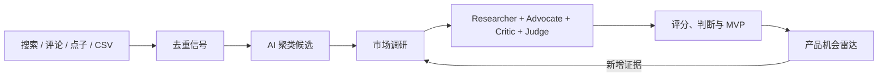

# Product Radar · 产品雷达

[English](./README.md) | **简体中文**

[](./LICENSE)
[](https://nodejs.org/)
[](https://react.dev/)
[](https://sqlite.org/)

> 一个用真实证据判断下一个 Web 或 iOS 产品是否值得开发的机会数据库。

产品雷达把点子、用户抱怨、搜索需求、竞争数据和 AI 分析整理成持续更新的产品机会流水线，面向独立开发者和小型产品团队。

## 核心能力

- **机会雷达**：搜索、筛选、排序并持续跟踪全部候选，而不是只生成一次 Top 10。
- **原始证据库**：收集点子、评论、访谈、公开网页、搜索数据、App Store 数据和 CSV。
- **自动发现**：对信号去重，由 AI 聚类相关需求并创建有证据支撑的候选。
- **四角色调研**：Researcher、Advocate、Critic、Judge 输出评分、风险、证据引用和 MVP 计划。
- **版本化判断**：保留历史报告、分数变化及每次更新使用的证据。
- **产品生命周期**：管理真实产品、核验状态、归档、回收站、恢复，并可把误归产品纠正为原始证据。
- **成本控制**：缓存付费数据，限制每日和每月 AI、DataForSEO 费用。
- **中英文支持**：覆盖英文和简体中文市场及展示内容。

## 工作流程



自动发现不会直接给出 `BUILD_NOW`。候选必须先完成证据采集和完整判断流程。

## 快速开始

环境要求：Node.js 22+、npm 10+，支持 macOS、Linux 和 Windows。

```bash
git clone https://github.com/xiao131/product-radar.git
cd product-radar
npm install
cp .env.example .env
npm run dev
```

打开 `http://127.0.0.1:5173`。开发模式包含：

- Web：`http://127.0.0.1:5173`
- API：`http://127.0.0.1:8787`
- SQLite：`./data/product-radar.db`

首次启动会自动创建数据库并载入可重复验证的演示数据。

## Demo 与真实调研

默认 Demo 模式不需要外部 API：

```env
RESEARCH_PROVIDER=demo
```

真实模式需要配置 AI 和 DataForSEO：

```env
RESEARCH_PROVIDER=real

AI_PROVIDER=deepseek
DEEPSEEK_BASE_URL=https://api.deepseek.com
DEEPSEEK_API_KEY=替换为你的密钥
AI_MODEL=deepseek-v4-flash

DATAFORSEO_LOGIN=...
DATAFORSEO_PASSWORD=...
```

支持的 AI 接入：

| Provider | 协议 | 主要变量 |
|---|---|---|
| DeepSeek | Chat Completions | `DEEPSEEK_BASE_URL`、`DEEPSEEK_API_KEY` |
| OpenAI | Responses | `OPENAI_BASE_URL`、`OPENAI_API_KEY` |
| Anthropic | Messages | `ANTHROPIC_BASE_URL`、`ANTHROPIC_API_KEY` |
| Vercel AI Gateway | Gateway | `AI_GATEWAY_API_KEY` |

真实模式可采集 DataForSEO 关键词和 SERP、Apple App Store 竞品、公开痛点页面及手工导入证据。付费结果会缓存，使用量保存在 SQLite，并在发起请求前检查费用硬上限。

多市场示例：

```env
RESEARCH_MARKETS=US:2840:en:en,CN:2156:zh_CN:zh-CN
```

完整配置见 [.env.example](./.env.example)。AI、市场、调度、缓存和预算也可以在“设置”页面调整。

## 典型用法

1. 把已经上线或确实正在开发的产品加入产品库。
2. 自动采集信号，或手工添加点子和用户反馈。
3. 把信号转为候选，或由 AI 聚类相关信号。
4. 在候选详情页执行调研。
5. 查看判断、九维评分、证据、风险和 MVP 计划。
6. 加入新证据后重新调研，同时保留旧报告。

产品库只用于真实存在或正在开发的产品；尚未开发的点子应进入“原始证据”。如果记录归类错误，应把它纠正为信号，而不是直接删除历史。

## 判断与评分

加权评分包含需求、痛点、趋势、付费意愿、竞争空档、用户触达、可构建性、个人匹配和证据新鲜度。

| 判断 | 含义 |
|---|---|
| `BUILD_NOW` | 证据和范围支持立即开始 MVP |
| `VALIDATE_FIRST` | 先验证付费意愿或其他关键假设 |
| `WATCH` | 等待更强趋势或新证据 |
| `SKIP` | 把时间投入更好的机会 |

高分不保证 `BUILD_NOW`；致命风险、证据不足或无法触达用户都可以否决候选。

## CSV 导入

“原始证据”和“产品库”都提供 UTF-8 CSV 示例模板、格式校验、重复检测、前 20 行预览和错误报告下载。

- 信号来源支持 `IDEA`、`REDDIT`、`X`、`APP_REVIEW`、`APP_STORE`、`SEARCH`、`TREND`、`FORUM`、`CUSTOMER`、`OTHER`。
- 产品平台支持 `UNKNOWN`、`WEB`、`IOS`、`WEB_AND_IOS`。
- 产品核验状态支持 `CONFIRMED`、`NEEDS_REVIEW`。
- 导入不会静默覆盖已有记录。

## 技术栈

```text
Frontend   React 19 / Vite 8 / TypeScript
Backend    Express 5 / Zod
Database   SQLite / better-sqlite3
AI         Vercel AI SDK
Testing    Vitest / Supertest
```

```text
src/       React 前端
server/    API、数据库、自动发现、调研、任务和备份
shared/    前后端共享类型与 Schema
specs/     需求、设计与实施计划
```

## 常用命令

```bash
npm run dev              # 前端 + API
npm run dev:api          # 仅 API
npm run dev:web          # 仅前端
npm run typecheck        # TypeScript 检查
npm test                 # 自动化测试
npm run build            # 生产前端构建
npm start                # 生产服务
npm run research:batch   # 手工执行调研批次
npm run localize:content # 回填中英文内容
```

## 生产部署

```bash
npm ci
npm test
npm run build
npm start
```

Express 在 `8787` 端口同时提供构建后的前端和 API。生产环境应放在 HTTPS 反向代理后，使用持久化 SQLite 路径并配置备份：

```env
APP_ENV=production
PUBLIC_ORIGIN=https://radar.example.com
AUTH_REQUIRED=true
DATABASE_PATH=/var/lib/product-radar/product-radar.db
BACKUP_DIRECTORY=/var/lib/product-radar/backups
SESSION_SECRET=至少32字符的高强度随机值
SEED_DEMO_DATA=false
RESEARCH_PROVIDER=real
```

首次部署使用至少 8 位的密码生成管理员哈希：

```bash
RADAR_ADMIN_PASSWORD='高强度管理员密码' npm run auth:hash
```

忘记密码时使用 `npm run auth:reset`。修改账号或密码后，旧会话会失效。

## 安全与当前边界

- 密钥只在服务端使用，保存的 AI Key 采用 AES-256-GCM 加密。
- 生产环境使用签名 HttpOnly 会话、SameSite Cookie、Origin、CSRF 和限流保护。
- AI 与 DataForSEO 使用量重启后不会清空，并受可配置硬预算保护。
- SQLite 面向个人或小团队单实例，不适合多个写入节点。
- Reddit 和 X 目前依赖公开搜索结果或手工/CSV 导入，尚未使用专用官方连接器。
- Apple 调研尚未采集每个竞品的完整评论主题。
- 生产服务目前通过 `tsx` 运行 TypeScript，尚未提供 Docker 和纯 Node 编译产物。

## 相关文档

- [开发与架构](./DEVELOPMENT.md)
- [产品设计](./product_radar_development_spec.md)
- [MVP 需求](./specs/product-radar-mvp/requirements.md)
- [MVP 技术设计](./specs/product-radar-mvp/design.md)
- [MVP 实施任务](./specs/product-radar-mvp/tasks.md)

欢迎通过 [GitHub Issues](https://github.com/xiao131/product-radar/issues) 提交需求和 Bug。提交 Pull Request 前请运行 `npm test`、`npm run typecheck` 和 `npm run build`。

## License

[MIT](./LICENSE) © 2026 xiao131
