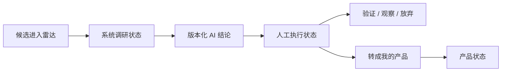

# 候选执行闭环技术设计

## 架构概览

本功能沿用现有单进程 Express + SQLite + React/Vite 架构，不增加服务或前端状态库。AI 调研状态、AI verdict、人工执行状态和产品状态保持为四个独立概念：



## 数据模型

### opportunities

新增：

- `workflow_status TEXT NOT NULL DEFAULT 'UNDECIDED'`
  - 允许值：`UNDECIDED`、`VALIDATING`、`APPROVED`、`WATCHING`、`REJECTED`。
- `workflow_updated_at TEXT`
  - 仅在人工执行状态发生变化时更新。

`workflow_status` 不参与 `decisionCurrent` 计算，不影响 `research_status`、`stale_since`、评分和报告版本。

### products

新增：

- `source_opportunity_id TEXT REFERENCES opportunities(id) ON DELETE SET NULL`
- 对非空 `source_opportunity_id` 建立唯一索引，保证一个候选最多转换成一个产品。

普通手工产品继续允许没有来源候选。

### 迁移

增加 SQLite schema migration v8。迁移只增加可空列、带默认值列和索引，兼容已有数据；所有历史候选默认 `UNDECIDED`。

## API 设计

### `PATCH /api/opportunities/:id/workflow`

请求：

```json
{ "workflowStatus": "VALIDATING" }
```

规则：

- 候选必须存在且至少有一份调研报告；
- 只更新人工执行状态、人工状态时间和记录更新时间；
- 不更新调研状态、stale watermark、评分或 verdict；
- 返回更新后的 `Opportunity`。

### `POST /api/opportunities/:id/promote`

规则：

- 候选必须存在且至少有一份调研报告；
- 首次调用创建 `BUILDING` 产品，预填候选名称、推荐平台、one-liner 与最新报告建议；
- 建立 `source_opportunity_id` 关联并把人工执行状态更新为 `APPROVED`；
- 复用现有产品组合失效逻辑，使依赖组合上下文的 AI 判断进入待重评；
- 重复调用幂等返回已有产品，不重复创建。

响应：

```json
{ "product": {}, "created": true }
```

### 现有读取接口

- `GET /api/opportunities/:id` 增加 `linkedProduct`。
- `GET /api/products` 的产品对象增加 `sourceOpportunityId`。
- `GET /api/opportunities` 继续使用已经存在的 `researchStatus` 查询参数。

## 前端设计

### 视觉规格

- 目的：明确区分 AI 结论与人工决定，并为每个阶段提供单一主操作。
- 方向：沿用 Industrial / utilitarian。
- 色板：`#171a18`、`#f4f1e8`、`#214e3b`、`#e76f3c`、`#d5d2c8`。
- 字体：Source Sans 3 与 IBM Plex Mono，作为既有品牌约束保留。
- 布局：保留宽内容区与窄操作轨道；增加横向阶段条；移动端按候选、调研、决策、执行顺序下排。

### 候选详情

- 在候选头部前增加“候选 → 调研 → 决策 → 执行”阶段条。
- 无报告时首要操作仍是开始或重试调研。
- 有报告时在右侧操作轨道最前显示“我的决策”：
  - 原生 select 允许手动更新执行状态；
  - 根据当前 AI verdict 提供主按钮；
  - AI 建议、人工状态和关联产品使用不同标签。
- 调研刷新控件降为次级操作卡，不删除原有缓存、预算确认和任务跟踪能力。
- 无报告时判断标题改为“尚未形成判断”。

### 候选库与首页

- 候选库增加调研状态筛选，并写入 URL。
- 候选表增加“下一步”列，使用按钮进入详情处理，不在列表直接产生不可逆副作用。
- 首页“待调研候选”统计改为可聚焦按钮，进入 `researchStatus=UNRESEARCHED` 的候选库。

### 我的产品

- 来源候选存在时显示“来自候选”链接，返回候选详情。
- 普通手工产品表现保持不变。

## 安全与一致性

- 新请求继续经过现有会话、Origin、CSRF 与普通请求限流边界。
- Zod 枚举校验所有人工状态值。
- 产品转换在单个 SQLite 事务中完成，并由唯一索引提供最终幂等保护。
- 转换不删除或更新任何历史报告。

## 测试策略

- 迁移测试：旧库升级后默认状态和唯一关联索引正确。
- API 测试：人工状态更新不改变 AI 结论；无报告拒绝；转换预填正确；重复转换幂等；详情返回关联产品。
- 回归测试：现有产品 CRUD、候选编辑失效、单候选调研和批量调研保持通过。
- 前端验证：候选筛选 URL、待调研按钮、人工状态更新、四种 verdict 主操作、转产品及来源返回路径。
- 发布验证：完整测试、类型检查、生产构建、无付费数据调用、服务健康检查。

## 部署策略

1. 本地通过测试与构建后创建单一 Git 提交并推送现有远端。
2. 生产更新前创建 SQLite 一致性备份并记录当前 commit。
3. 服务器拉取目标 commit，执行 `npm ci` 与 `npm run build`。
4. 重启现有单实例服务；启动时自动执行 v8 迁移。
5. 验证健康接口、首页、候选详情和迁移版本；失败时恢复上一 commit 与部署前数据库备份。
