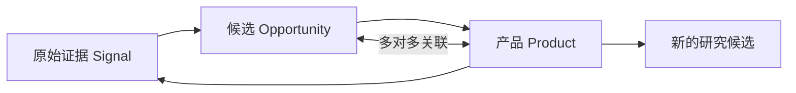

# 产品生命周期闭环技术设计

## 对象关系

日常操作只新增关系和派生记录；“纠正为原始证据”是单独的资料纠错事务。

## 数据模型与迁移

新增 SQLite migration v13：

- 重建 `products`：
  - `platform` 境加 `UNKNOWN`；
  - `status` 移除 `IDEA`；
  - 增加 `verification_status`、`trashed_at`、`reclassified_signal_id`、`merged_into_product_id`；
  - 保留 `source_opportunity_id` 作为最初来源的兼容字段。
- `signals.product_id`：记录反馈或纠错证据的产品来源。
- `evidence_items.product_id`：信号进入候选证据账本后继续保留产品来源。
- `product_opportunity_links`：保存产品与候选的多对多关系及 `ORIGIN`、`RESEARCH`、`EXISTING` 关系类型。
- 回填既有 `source_opportunity_id` 为 `ORIGIN` 关系。
- 将所有历史 `IDEA` 产品、用户确认的六条误分类产品，以及三条从未开发但被标成 `ARCHIVED` 的历史候选转为原始证据，并保存产品快照到信号元数据。

## API

- `GET /api/products?trash=active|trashed`：分别读取活跃产品和回收站。
- `GET /api/products/:id`：返回产品、关联候选、反馈数量和删除依赖。
- `POST /api/products/:id/feedback`：创建产品反馈信号，可选立即关联候选。
- `POST /api/products/:id/research-candidate`：创建候选、产品历史证据和 `RESEARCH` 关系。
- `POST /api/products/:id/reclassify-to-signal`：事务性纠正为原始证据并移入回收站。
- `POST /api/opportunities/:id/products`：关联已有产品。
- `POST /api/products/:id/merge`：迁移关系后把源产品移入回收站。
- `DELETE /api/products/:id`：软删除到回收站。
- `POST /api/products/:id/restore`：恢复。
- `DELETE /api/products/:id/permanent`：依赖检查后永久删除。

## 前端设计规格

- Purpose：让独立开发者一眼区分“已执行资产”和“等待研究的想法”，并能从产品反馈回到证据与候选，不丢失来源。
- Aesthetic Direction：沿用既有 Industrial / utilitarian，不引入新的视觉主题。
- Color Palette：沿用 `#171a18`、`#f4f1e8`、`#214e3b`、`#e76f3c`、`#d5d2c8`。
- Typography：沿用 Source Sans 3 与 IBM Plex Mono；这是现有品牌约束。
- Layout Strategy：桌面保留宽产品信息与窄操作轨道；窄屏改为纵向信息块，状态和操作固定可见，不再使用 1020px 横向表格。

### 产品列表

- 增加“产品库 / 回收站”切换。
- 产品名称进入详情；每行始终显示平台、状态、可信度和操作菜单。
- 操作菜单包含编辑、继续调研、记录反馈、纠正为证据、归档/恢复、合并、移到回收站。

### 产品详情

- 顶部显示产品身份、平台、生命周期状态和可信度。
- 主区显示说明、当前重点、来源候选与关联候选。
- 右侧/底部操作区提供继续调研、记录反馈、纠正、归档和删除。
- 回收站详情只提供恢复、查看转换/合并去向和永久删除。

### 候选详情

- 保留现有“转成我的产品”。
- 增加“关联已有产品”，避免针对现有产品重复创建新记录。
- 展示全部关联产品，而不是只显示一个来源产品。

## 一致性与安全

- 纠错、合并、创建关联候选均使用 SQLite 事务。
- 永久删除前统计关联候选、产品信号与产品证据；存在有效依赖时返回 409。
- 研究上下文只读取未删除且已确认产品；归档产品仍作为历史资产提供给研究提示，状态本身用于区分活跃性。
- 产品组合变化继续触发现有候选重评水位。

## 测试策略

- 迁移：旧 `IDEA` 和六条误分类数据转信号，未知平台、可信度和关系表正确。
- API：反馈、创建候选、关联已有产品、纠错、归档、回收站、恢复、合并和永久删除保护。
- 回归：CSV 导入、候选转产品、调研、Dashboard 和已有迁移继续通过。
- 浏览器：产品列表窄屏、产品详情、操作菜单、反馈、继续调研、纠错和回收站主流程。
