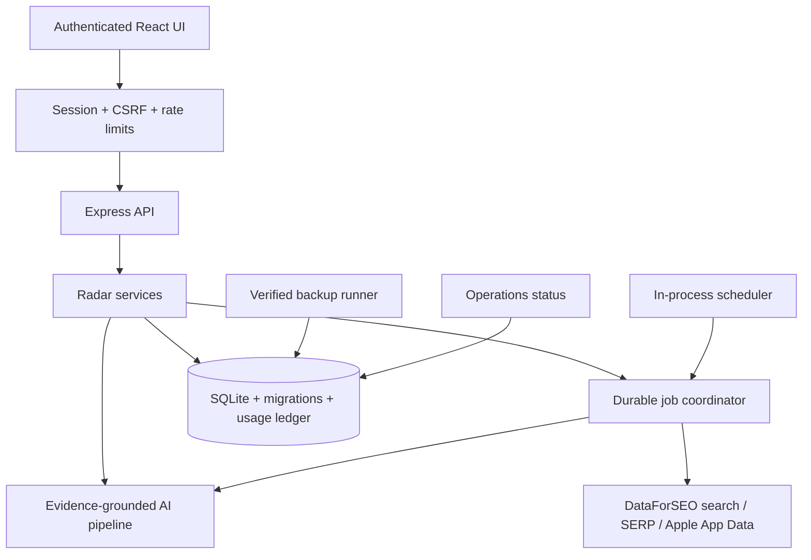

# Product Radar Production Readiness Design

## Architecture



The deployment remains one Node.js process and one SQLite database. Background
work uses durable database locks and job records, not a separate queue service.
This keeps the personal-production system recoverable without adding distributed
infrastructure.

## Security

- `APP_ENV=production` activates strict configuration validation.
- `ADMIN_PASSWORD_HASH` uses Node `scrypt`; a CLI script creates the hash.
- `SESSION_SECRET` signs a short opaque session payload with HMAC SHA-256.
- The session cookie is HttpOnly, SameSite=Strict and Secure in production.
- A double-submit CSRF cookie plus `X-CSRF-Token` protects mutations; an
  allowlisted Origin check provides a second boundary.
- `/api/health/live` remains public. Login endpoints have their own rate limit.
  All radar data and mutations require authentication in production.
- `helmet` supplies CSP and baseline headers. Internal 500 messages stay in
  structured logs and are not returned to clients.

## Evidence ingestion

`signals` remains the raw inbox. Processing or linking a signal creates a
`COMPLAINT` evidence item with:

- deterministic source fingerprint for deduplication;
- raw content, source type, source URL and created timestamp;
- market-neutral metadata;
- opportunity association.

`POST /api/signals/:id/process` accepts an optional existing opportunity ID.
The Signals UI offers “new candidate” and “link to candidate”. Linking marks
`last_researched_at` null so the next batch evaluates the new evidence.

## Research providers

The existing DataForSEO credential is reused:

- Keywords Data / Google Ads: demand, monthly change, CPC and ad competition;
- Google organic SERP: visible competitors and result density for Web;
- Apple App Data / App Searches: iOS competitors, prices, ratings and review
  counts for iOS and Web+iOS.

Location and language come from `MARKET_LOCATION_CODE`,
`MARKET_LANGUAGE_CODE` and `MARKET_COUNTRY_CODE`. Optional provider failures
become explicit evidence gaps. Paid competitor calls can be disabled separately
for cost control.

DataForSEO Apple App Data supports App Store search, rating and review metadata,
while its SERP API supports market-specific organic result collection. Both use
the existing DataForSEO account and Standard delivery where latency is not
interactive-critical.

## AI integrity

Signals and provider text are wrapped as untrusted evidence. Prompts explicitly
forbid following instructions found in evidence.

The Judge returns:

- nine unique canonical dimension scores without editable weights;
- verdict and platform analysis;
- cited decisive claims (`text`, `evidenceIds`);
- unknowns, risks and MVP scope.

Application code restores canonical labels/weights and computes the weighted
score. AI still chooses the verdict. A sufficiency guard prevents unsupported
high-confidence BUILD_NOW output when independent category coverage is too low;
the stored report explains the guard.

The report payload records:

- prompt version and model ID;
- exact evidence snapshot and coverage summary;
- normalized dimensions and computed score;
- model usage and provider usage known to the application;
- claim-level evidence IDs.

## Durable operations

New tables:

- `schema_migrations`: applied migration versions;
- `job_runs`: scheduled/manual job state, result and duration;
- `job_locks`: globally exclusive jobs with stale expiry;
- `usage_events`: durable provider request, token and reported-cost ledger;
- `backup_runs`: verified backup history.

On startup, migrations run before routes open. SQLite uses WAL, foreign keys and
a configured `busy_timeout`.

The in-process scheduler wakes periodically but executes a job only after
claiming the database lock. This works in a single container and avoids requiring
host cron. A CLI batch command remains available and uses the same lock.

Provider calls use timeout, bounded retries and jittered backoff. Daily durable
limits protect AI runs and DataForSEO tasks. Optional alerts send sanitized JSON
to `ALERT_WEBHOOK_URL`.

Backups use the `better-sqlite3` backup API, run integrity verification, prune by
retention count and write status to `backup_runs`.

## Deferred production build and deployment boundary

The owner explicitly deferred compilation and container work. The current source
implementation keeps the existing `tsx` server runtime and Vite frontend build.
A later deployment task will add pure Node server artifacts, Docker, Compose,
health checks and persistent-volume wiring without changing the application
capabilities implemented here.

## UI design specification

### Purpose

Add only the operational surfaces needed to trust the radar: login, source/job
status and signal-to-candidate linking. The decision dashboard remains the first
screen after login.

### Aesthetic direction

Industrial/utilitarian, continuing the current evidence workstation.

### Palette

- ink `#171A18`;
- paper `#F4F1E8`;
- forest `#214E3B`;
- action orange `#E76F3C`;
- failure red `#A63D2F`.

### Typography

Existing brand override: Source Sans 3 for reading and IBM Plex Mono for system
labels and metrics.

### Layout

- Login: asymmetric two-column composition with a broad trust/explanation rail
  and a narrow credential rail.
- Operations: existing shell and sidebar; staggered status bands, source matrix
  and vertical job history rather than a centered generic card grid.
- Signal linking: reuse the existing modal and form system.

## API additions

```text
GET  /api/health/live
GET  /api/health/ready
GET  /api/auth/session
POST /api/auth/login
POST /api/auth/logout
GET  /api/operations/status
POST /api/operations/research
POST /api/operations/backup
POST /api/signals/:id/link
GET  /api/opportunities/options
```

Existing research routes remain but pass through authentication, CSRF, durable
budgets and job coordination.

## Testing

- unit tests: password/session signing, CSRF, score normalization, coverage guard,
  retry policy, budget ledger and migration ordering;
- API tests: auth boundaries, signal linking, operations status and job locks;
- provider contract tests: Google Ads, SERP and Apple App Data fixtures;
- backup integration test with integrity check;
- production start smoke test against compiled server;
- browser flows: login, dashboard, link signal, run due refresh and inspect status.

## Trade-offs

- SQLite remains correct for a single write node; multi-node deployment is
  intentionally rejected.
- In-process scheduling is simpler than Redis/queues; durable locks and job
  records provide enough restart safety for one production instance.
- Reddit/X automation is deferred; compliant manual/CSV evidence becomes fully
  useful immediately.
